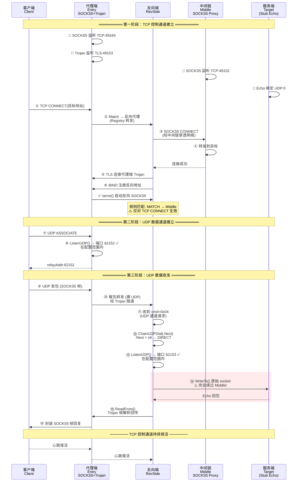

# 反向 UDP E2E 测试 — 实际拓扑时序图



## 端口分配汇总

| 组件 | 端口 | 协议 | 说明 |
|------|------|------|------|
| **代理端** Entry | `62152` ✅ | UDP | ListenUDP，在 [62152~62163] 范围内 |
| **反向端** RevSide | `62153` ✅ | UDP | ListenUDP，在 [62152~62163] 范围内 |
| **中间链** Middle | `N/A` | — | 不在 UDP 数据路径中 |
| **代理端** Entry | `49164` | TCP | SOCKS5 控制通道 |
| **中间链** Middle | `49152` | TCP | SOCKS5 控制通道（仅 TCP 使用）|
| **代理端** Entry | `49153` | TLS | Trojan 控制通道 |
| **服务端** Target | `62153` | UDP | Echo 桩服务（系统分配，非受控）|

## 关键发现

```
⚠️ 中间链 Middle 仅参与 TCP 控制路径（步骤 ③⑧）
   UDP 数据在步骤 ⑭ 直接用原始 socket 发往服务端，完全绕过 Middle

   原因: handleReverseUDPChannel() 调用 ChainUDPDial(reverseProxy.Next)
         reverseProxy = LOCAL_TJ (Trojan)，其 .Next = nil
         Init() 时解析为 DIRECT → 原始本地 socket (ListenUDP)
         该调用不经过规则匹配引擎，因此跳过了 Middle 配置
```
