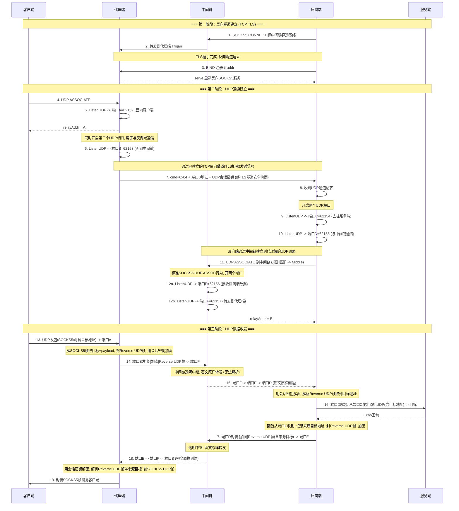

# 反向 UDP E2E 测试 — 正确架构设计时序图

## 拓扑关系

```
  客户端        代理端 Entry       中间链 Middle      反向端 RevSide     服务端 Target
   │              │                   │                  │                 │
   │              │  SOCKS5:49164      │                  │                 │
   │◄─────────────│                   │                  │                 │
   │              │  Trojan:49153      │                  │                 │
   │              │◄──────────────────│──SOCKS5:49152────│                 │
   │              │                   │                  │                 │
   │              │                   │                  │    Echo:UDP:0   │
   │              │                   │                  │◄────────────────│
```

## 时序图（正确设计）



## UDP 端口分配（正确设计：6个受控端口）

| # | 组件 | 端口 | 用途 | 通信对象 |
|---|------|------|------|----------|
| A | **代理端** | `62152` ✅ | SOCKS5 UDP Relay | ↔ 客户端 |
| B | **代理端** | `62153` ✅ | 与中间链通信([加密]Reverse UDP帧) | ↔ 中间链端口F |
| C | **反向端** | `62154` ✅ | 目标服务请求(原始UDP) | ↔ 服务端 |
| D | **反向端** | `62155` ✅ | 与中间链通信([加密]Reverse UDP帧) | ↔ 中间链端口E |
| E | **中间链** | `62156` ✅ | 接收反向端数据(透传密文流) | ↔ 反向端端口D |
| F | **中间链** | `62157` ✅ | 转发到代理端(透传密文流) | ↔ 代理端端口B |

范围: [62152 ~ 62163] 共12个端口，使用6个 ✅

## 数据流完整路径（带帧格式标注）

```
请求方向:
+------------------+                         +------------------+
| 客户端           | --[SOCKS5 UDP帧]------> | 代理端 端口A     |
|                  |   (RSV+ATYP+目标+DATA)  | (62152)         |
+------------------+                         +--------+---------+
                                                     |
                                                     | 解包: 提取目标地址 + payload
                                                     | 封装 Reverse UDP 帧
                                                     v
+------------------+       [加密]Reverse UDP帧    +------------------+
| 代理端 端口B     | ------------------------> | 中间链 端口F     |
| (62153)         |   (密文, 含目标地址)        | (62157)         |
+--------+---------                            +--------+---------
                                                   |
                                                   | 透明中继 (不解析, 搬运密文)
                                                   v
+------------------+       [加密]Reverse UDP帧    +------------------+
| 中间链 端口E     | <------------------------ | 反向端 端口D     |
| (62156)         |   密文原封不动              | (62155)         |
+--------+---------                            +--------+---------
         |                                          |
         |  (中间链侧对称路径, 略)                    | 解密 + 解析 Reverse UDP 帧得目标地址 + payload
         v                                          v
+------------------+                            +------------------+
| 中间链 端口F     |                            | 反向端 端口C     |
| (62157)         |                            | (62154)         |
+--------+---------                            +--------+---------
                                                   |
                                                   | 原始 UDP (payload only, 目标在WriteTo参数中)
                                                   v
                                            +------------------+
                                            | 服务端 Echo      |
                                            | (Stub)           |
                                            +------------------+

回复方向 (反向):
服务端 Echo 回包 -> 端口C ReadFrom() 收到 (srcAddr = 目标地址)
  -> 用 srcAddr 作为"来源目标", 封装 Reverse UDP 帧 + 加密
  -> 从端口D WriteTo(ciphertext, 端口E地址) 发出
  -> 中间链 透明中继 (E -> F)
  -> 端口B ReadFrom() 收到, 解密 + 解析 Reverse UDP 帧得来源目标
  -> 封装 SOCKS5 UDP 帧 (目标字段填来源目标), 从端口A WriteTo 回给客户端
```

## Reverse UDP 帧格式定义

```
为什么需要 Reverse UDP 帧?
===========================
中间链是透明的! 它只做字节搬运, 不理解业务语义.
如果 B->F 发的是裸 UDP payload, 反向端收到后不知道该发给哪个目标服务.
所以代理端和反向端之间需要一个 "带目标地址的帧协议".

密钥协商:
=========
步骤7 (经TLS加密的TCP通道):
  代理端生成随机会话密钥 (32字节)
  随 cmd=0x04 + 端口B地址 一起发给反向端
  -> 密钥在TLS隧道内传输, 中间链无法截获
  -> 后续所有Reverse UDP帧都用此密钥加解密

Reverse UDP 帧格式 (明文结构, 传输时整体加密):
+------+------+----------+------+----------+
| RSV  | ATYP | ADDR     | PORT | PAYLOAD          |
| 2B   | 1B   | variable | 2B   | variable         |
+------+------+----------+------+----------+

RSV  = 0x0000 (保留字段, 全零)
ATYP = 地址类型: 0x01(IPv4) / 0x03(Domain) / 0x04(IPv6)
ADDR = 目标地址 (IPv4=4B / Domain=1B+len / IPv6=16B)
PORT = 目标端口 (大端序)
PAYLOAD = 完整的原始UDP payload

实际传输 (经过对称加密):
+----------+------------------+
| NONCE    | CIPHERTEXT(含认证标签) |
| 12B      | variable         |
+----------+------------------+

加密方式: ChaCha20-Poly1305 (或 AES-128-GCM)
  - 每包随机12字节Nonce (前缀模式, 无需维护计数器)
  - AEAD: 同时保证机密性 + 完整性(防篡改)
  - 密钥来源: 步骤7 TLS通道内协商的会话密钥

示例 (发往 example.com:8080, 加密前):
00 00 03 0B 65 78 61 6D 70 6C 65 2E 63 6F 6D 1F 90 [payload...]
       ^^  ^^^^^^^^^^^^^^^^^^^^^^^^^^^^ ^^^^
       |    |                          |
       |    domain="example.com"       port=8080
       ATYP=Domain(0x03)

完整协议栈 (含加密层):
======================
客户端 <---> 代理端A:        SOCKS5 UDP帧 (标准协议, 含目标地址)
                               ↓ 解包提取目标+payload
代理端B <---> 中间链:        [加密] Reverse UDP帧 (自有协议)
                               ↓ 中间链不解析, 透明搬运密文
中间链 <---> 反向端D:        同上 (密文原封不动到达)
                               ↓ 解密 + 解析提取目标+payload
反向端C <---> 服务端:        原始UDP (payload only, 目标在socket addr中)

代理端 <-> 反向端(TCP控制):  TLS + Trojan帧 (信号: cmd+端口+密钥)

## 中间代理链的通用性

> **中间链不是固定的单个 SOCKS5，而是一个通用的 UDP 代理链。**

```
E2E 测试简化版:   反向端 → [SOCKS5]              → 代理端
实际通用场景:      反向端 → [协议1] → [协议2] → ... → [协议N] → 代理端
                            ↑         ↑              ↑
                        Trojan    VMess/SS       SOCKS5
                        (UDP)      (UDP)          (UDP)
```

**关键点：**
- 每跳只需支持 UDP 转发（如 SOCKS5 UDP ASSOCIATE、Trojan UDP、VMess UDP 等）
- 链式组合与 TCP 代理链同理，反向端通过 `ChainUDPDial` 从规则匹配开始走整条链
- 图中"中间链"是 E2E 测试的简化表达，实际可替换为任意长度的多协议链
- **无论中间链多复杂、多少跳，它对 [加密]Reverse UDP 帧都是透明的**
- **即使中间链是无加密协议(如纯SOCKS5)，UDP数据也是安全的（AEAD加密保护）**

## 当前实现的 Bug

```
+--------------------------------------------------------------+
|  X 当前代码实际行为 (仅有2个端口, 绕过中间链)                  |
+--------------------------------------------------------------+
|                                                              |
|  handleReverseUDPChannel() 调用                              |
|    ChainUDPDial(reverseProxy.Next)                           |
|                                                              |
|  reverseProxy = LOCAL_TJ (Trojan), .Next = nil               |
|  -> Init() 解析为 DIRECT (不经过规则匹配引擎!)                |
|  -> 直接 ListenUDP() 原始 socket                              |
|                                                              |
|  结果:                                                       |
|    缺失: 端口B、D、E、F (整个中间链被跳过)                    |
|    合并: 端口C = 端口D (只有1个UDP socket)                    |
|    路径: 反向端直接 raw socket -> 服务端                      |
|                                                              |
+--------------------------------------------------------------+
```

## 需要修复的点

| 问题 | 正确行为 | 当前行为 |
|------|----------|----------|
| 代理端 UDP 端口数 | 2个 (A面向客户端 + B面向中间链) | 1个 (仅A) |
| 反向端 UDP 端口数 | 2个 (C面向服务端 + D面向中间链) | 1个 (C=D合并) |
| 中间链 UDP 端口数 | 2个 (E收反向端 + F转代理端) | 0 (完全不参与) |
| 中间链参与 UDP | 标准SOCKS5 UDP ASSOCIATE | 完全绕过 |
| 规则匹配 | UDP 也应走规则引擎 | UDP 直接 DIRECT |
| B<->M 协议 | [加密]Reverse UDP帧 (带目标地址, 中间链透明) | N/A |
| R<->M 协议 | [加密]Reverse UDP帧 (同上, 透明中继) | N/A |
| 为何需要帧协议 | 中间链透明, 反向端需知道目标地址 | 当前无此问题(DIRECT直连) |
| UDP加密 | 步骤7 TLS通道内协商会话密钥, ChaCha20-Poly1305 AEAD | 无加密 |
