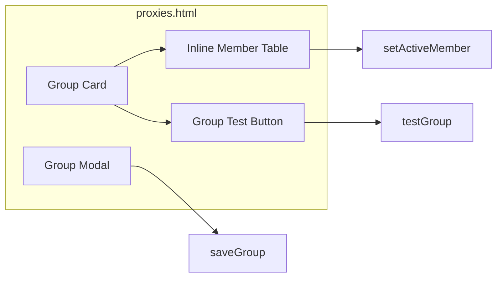

# subscription_group_refactor.md

## 元数据

- 文档类型：Plan
- 版本：v0.2.1
- 所属项目：phaethon
- 创建日期：2026-07-14

## 变更记录

| 版本 | 日期 | 变更内容 | 作者 |
|------|------|----------|------|
| v0.1.0 | 2026-07-14 | 初始版本：订阅/代理组 UI 简化方案 | Claude |
| v0.1.1 | 2026-07-14 | 调整 Members 顺序为订阅节点在前、手动成员在后，使手动代理成为真正的兜底 | Claude |
| v0.2.0 | 2026-07-14 | 重构订阅组概念：移除 static/dynamic 订阅模式，membership 与 active 解耦 | Claude |
| v0.2.1 | 2026-07-15 | 明确保留 Group Modal 编辑，不改为内联编辑；清理 i18n 中废弃的 static/dynamic 文案 | Claude |

## 1. 背景与目标

### 1.1 当前问题

当前代理组在 `subscription` 之上又叠加了 `subscription-mode`（`static` / `dynamic`）概念：

- `static` 模式下，`subscription-selected` 既表示“哪些订阅节点属于本组”，又间接表示“当前 active 节点”。点击成员表切换 active 时，会把 `subscription-selected` 改成单节点，导致其他订阅节点从组里消失。
- `dynamic` 模式下，组成员由健康检查结果动态决定，与 group type（`select` / `best` / `load-balance`）职责重叠。
- 这种设计与主流代理客户端（Clash、Surge、Shadowrocket 等）不一致，也增加了用户理解成本。

### 1.2 重构目标

1. **移除 `subscription-mode` 字段**：不再需要显式声明 static / dynamic。
2. **membership 与 active 解耦**：
   - membership 由 `subscription` + `subscription-filter` + `proxies`（手动成员）自动决定。
   - active 由 group type 决定：`select` 由用户/持久化指定；`best` / `load-balance` 由运行时策略决定。
3. **简化 NodeViewer**：不再作为“往组里加节点”的必经入口，仅作为查看/排除订阅节点的辅助弹窗。
4. **保持现有合理行为**：订阅节点在前、手动成员在后；手动代理作为订阅节点全部不可用时的兜底。

## 2. 架构调整

### 2.1 后端

```mermaid
flowchart TD
    A[Admin UI] -->|GET /api/groups/{name}/members| B[admin.go: apiGroupMembers]
    A -->|POST /api/groups/{name}/test| C[admin.go: apiGroupTest]
    A -->|POST /api/groups/{name}/active-member| D[admin.go: apiGroupActiveMember]
    B --> E[config.ProxyGroup.Members]
    C --> F[main.go: checkProxyHealth / SetHealthImmediate]
    D --> G[更新 ActiveMember / ManualProxies 顺序]
```

核心修改：

- 从 `ProxyGroup` 和 Admin API 中移除 `subscription-mode`。
- `SubscriptionSelected` 语义变更（或新增 `ActiveMember`）：在 `select` 组里仅表示“当前 active 节点名”；不再作为 membership。
- `rebuildProxiesLocked()` 中，`SubMembers` = 订阅候选池中所有匹配 `SubscriptionFilter` 的节点，不再只取 `SubscriptionSelected`。
- `apiGroupActiveMember` 仅修改 active 指针/顺序，不修改 membership。
- `GET /api/groups/{name}/members` 返回全部成员，并标记当前 active 行。
- `GET|PUT /api/groups/{name}/subscription` 保留，但变为只读/排除管理，不再决定 membership。

### 2.2 前端



页面变化：

- `proxies.html`：
  - 保留 Group Modal 作为编辑入口（字段多，弹窗比内联展开更紧凑）。
  - Group Modal 移除 `subscription-mode` 选择按钮（静态/动态）。
  - 成员表格默认展示全部成员（订阅节点 + 手动成员）。
  - `select` 组点击成员行只切换 active 高亮，不删除其他成员。
  - “高级筛选”小按钮保留，但文案/行为改为“查看订阅节点”或“排除节点”。
- `subscriptions.html`：维持当前简化后的状态，不再变动。
- `app.js`：`NodeViewer` 不再修改 `subscription-selected` 的 membership，仅用于查看/排除。

## 3. 关键设计决策

### 3.1 组成员构成

运行时 `Members` 的生成规则：

1. `ManualMembers` 由 `Proxies` 解析而来，可包含普通代理、DIRECT、REJECT 或嵌套代理组。
2. `SubMembers` 由 `Subscription` + `SubscriptionFilter` 决定：
   - 若未配置 `Subscription`，`SubMembers` 为空。
   - 若配置了 `Subscription`，取该订阅源中所有匹配 `SubscriptionFilter` 的节点。
   - `SubscriptionFilter` 为空时，取全部节点。
3. `Members` = `SubMembers` + `ManualMembers`，订阅节点在前，手动成员在后。
4. 订阅刷新后，`SubMembers` 自动重建， membership 自动更新。

### 3.2 Active 标记

| Group Type | Active 产生方式 |
|---|---|
| `select` | 优先使用持久化的 `ActiveMember`；若该成员已不存在（被 filter 过滤或订阅刷新后移除），回退到 `Members` 第一个成员。 |
| `best` | 运行时计算：存活成员中延迟最低者。 |
| `load-balance` | 运行时轮询索引指向的存活成员。 |

`select` 组点击成员表某一行时：

- 前端调用 `POST /api/groups/{name}/active-member`。
- 后端只修改 `ActiveMember`（或把该成员移到 `ManualProxies` 首位以兼容无新字段的旧配置），不修改 `SubscriptionSelected` 或 filter。
- 保存配置后触发 reload。

### 3.3 健康检查

- 周期健康检查仍只针对订阅节点执行（手动代理默认 alive）。
- 组级“测速”对所有 `Members` 执行一次性检查，结果写入 group healthMap。
- `best` / `load-balance` 组在测速后按健康结果重新计算 active。

### 3.4 NodeViewer 定位

- 不再是“没有它组就不生效”的必需入口。
- 打开时显示该订阅源全部候选节点，以及当前 filter 过滤后的节点。
- 可用于快速编辑 `subscription-filter` 正则，或标记某些节点为“排除”。
- 如果实现“排除”功能，可在 filter 之外增加 `subscription-exclude` 列表（可选，不在本次最小改动范围内）。

## 4. Admin API 调整

### 4.1 请求/响应字段

- `GET /api/groups` 与 `POST /api/groups` 不再返回/接收 `subscription-mode`。
- `GET /api/groups/{name}/members`：
  - `selected` 字段语义：表示“该节点是否属于本组”。订阅节点且匹配 filter 时为 true；手动成员恒为 true。
  - `active` 字段语义：按 group type 计算出的当前生效成员。
- `POST /api/groups/{name}/active-member`：
  - 仅对 `select` 组生效。
  - 请求体：`{ "name": "vless-443", "source": "subscription" }`。
  - 行为：设置 `ActiveMember = name`，不修改 membership。
- `GET|PUT /api/groups/{name}/subscription`：
  - `GET` 返回订阅候选与当前 filter。
  - `PUT` 不再批量写入 `subscription-selected`（或仅用于写入 `subscription-filter` / exclude 列表）。

### 4.2 配置持久化规则

1. YAML 中移除 `subscription-mode`。
2. YAML 中保留 `subscription`、`subscription-filter`、`proxies`。
3. `subscription-selected` 废弃；新增 `active-member`（string，仅 `select` 组）。
4. 编辑 `select` 组并切换 active 时，持久化 `active-member`，不修改 `proxies` 顺序（或把 active 手动成员移到首位以兼容旧 UI）。

## 5. 迁移与兼容性

### 5.1 旧配置升级

加载旧配置时，若遇到 `subscription-mode` 或 `subscription-selected`：

1. 忽略 `subscription-mode`。
2. 若 `subscription-selected` 非空且 group type 为 `select`：
   - 将 `subscription-selected` 中第一个有效节点名迁移为 `active-member`。
   - 清空 `subscription-selected`。
3. 其余情况下直接丢弃 `subscription-selected`。

这样旧 static 组在升级后会自动包含全部匹配 filter 的订阅节点，而不是只保留原先手动选中的几个。

### 5.2 前端兼容性

- 旧 UI 中“选择节点”弹窗保存后写入 `subscription-selected` 的调用需要移除或改为只修改 filter / exclude。
- 成员表格增加“点击设置 active”的交互，仅对 `select` 组启用。

## 6. 风险与回退

| 风险 | 影响 | 缓解 |
|------|------|------|
| 废弃 `subscription-selected` 后，旧 static 组节点范围扩大 | 中 | 通过迁移逻辑把旧 `subscription-selected` 转成 `active-member`，同时用 filter 控制 membership；用户如需精确控制可用 filter / exclude |
| `select` 组 active 指针指向被 filter 排除的节点 | 低 | 初始化/刷新时校验：若 `active-member` 不在当前 `Members` 中，回退到第一个成员 |
| 前端一次性渲染大量订阅节点性能差 | 中 | 成员表格默认渲染前 50 条，超出折叠或分页 |
| 移除 subscription-mode 可能影响依赖 dynamic 自动筛选的逻辑 | 中 | `best` / `load-balance` 本身就按健康结果选择，dynamic 的“只选存活”语义由 group type 承担 |

## 7. 验收标准

- [x] `subscription-mode` 字段从配置、API、UI 中完全移除。
- [x] `select` 组点击成员行只切换 active，不删除其他成员。
- [x] 订阅刷新后，新节点自动出现在成员表中（受 filter 限制）。
- [x] `best` / `load-balance` 组测速后自动按策略更新 active 标记。
- [x] Group Modal 不再显示 static/dynamic 切换按钮。
- [x] Group Modal 保留弹窗形式，不改为内联编辑。
- [x] NodeViewer 不再控制 membership，仅用于查看/编辑 filter。
- [x] i18n 中不再出现 static/dynamic / manual-subscription 模式等废弃文案，且无中英混杂。
- [x] 旧配置加载无 panic，且行为符合迁移规则。
- [x] `go test ./...` 通过，`go build` 成功。
- [x] 远程测试环境验证通过。
