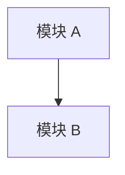

# Plan 模板

## 元数据

- 文档类型：Plan
- 版本：v0.1.0
- 所属项目：phaethon
- 创建日期：YYYY-MM-DD

## 变更记录

| 版本 | 日期 | 变更内容 | 作者 |
|------|------|----------|------|
| v0.1.0 | YYYY-MM-DD | 初始版本 | 作者 |

## 1. 背景与目标

### 1.1 当前问题

...

### 1.2 目标

1. 目标一。
2. 目标二。

## 2. 架构调整

### 2.1 后端

### 2.2 前端

...

## 3. 关键设计决策

### 3.1 决策一

...

## 4. 接口/交互调整

...

## 5. 迁移与兼容性

...

## 6. 风险与回退

| 风险 | 影响 | 缓解 |
|------|------|------|
| ... | 高/中/低 | ... |

## 7. 验收标准

- [ ] 标准一。
- [ ] 标准二。
