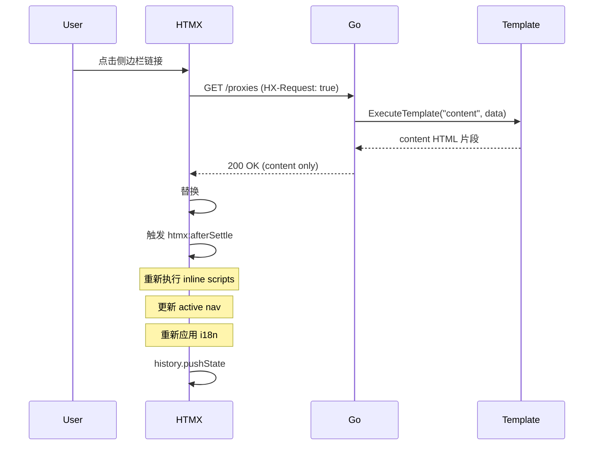

# Admin SPA 设计文档

> 版本: 0.1.0
> 日期: 2026-09-01
> 状态: DRAFT
> 负责人: Phaethon Dev

## 变更记录

| 版本 | 日期 | 变更内容 | 作者 |
|------|------|----------|------|
| 0.1.0 | 2026-09-01 | 初始版本：HTMX SPA 架构设计 | Qoder |

## 1. 背景与目标

### 1.1 当前问题

Admin 是 MPA 架构，菜单切换导致整页刷新，PiP 日志窗口被销毁，SSE 连接反复断开重连。

### 1.2 目标

1. PiP 日志窗口跨菜单保持
2. SSE 连接持久化
3. 菜单切换无刷新

## 2. 架构设计

### 2.1 核心思路

```
所有页面共享 layout.html（sidebar + topbar + SSE + PiP）
菜单链接改为 hx-get + hx-swap，只加载 content 片段
Go 后端检测 HX-Request 头，只渲染 content 块（不含 layout）
```

### 2.2 HTMX 工作流程

```
首次加载: 浏览器 → Go Handler → 完整 HTML（layout + content）
后续导航: HTMX 拦截 → GET /path + HX-Request: true → Go 只渲染 content → HTMX 替换 #main-content
```

点击链接时：
1. HTMX 拦截点击，发送 `GET /proxies` + `HX-Request: true` 头
2. Go 检测到 `HX-Request` 头，调用 `ExecuteTemplate(w, "content", data)` 只渲染 content 块
3. HTMX 将返回的 HTML 替换 `#main-content` 的内容
4. URL 更新（`hx-push-url="true"`）
5. Layout（sidebar、SSE、PiP）保持不变

### 2.3 时序图



## 3. 关键设计决策

### ADR 1: HTMX 而非 React/Vue SPA

**决策**：使用 HTMX + Go 模板片段加载，而非 React/Vue 全 SPA。

**理由**：
- Go-only 团队，无专职前端
- 现有 Go 模板 + 原生 JS 代码可复用
- 不需要 Node.js 构建链
- 迁移成本最低（页面模板几乎不改）

**代价**：
- 需要引入 HTMX 库（~47KB）
- inline script 需要手动重执行

### ADR 2: ExecuteTemplate 渲染 content 块

**决策**：利用 Go 模板的 `ExecuteTemplate(w, "content", data)` 直接渲染命名块。

**理由**：
- 每个页面已定义 `{{define "content"}}...{{end}}`
- 无需标记、无需 DOM 解析
- 代码改动最小（render() 加一个 if 分支）

### ADR 3: htmx:afterSettle 重执行 inline scripts

**决策**：在 `htmx:afterSettle` 事件中 clone-and-replace 所有 `<script>` 标签。

**理由**：
- 浏览器不执行 innerHTML 注入的 script
- clone-and-replace 是标准做法
- 保持页面模板的 inline script 不变

## 4. 文件变更

| 文件 | 改动类型 | 说明 |
|------|----------|------|
| `admin/admin.go` | 修改 | `render()` 添加 HX-Request 分支 |
| `admin/templates/layout.html` | 修改 | 引入 HTMX、nav links 添加 hx-* 属性 |
| `admin/static/app.js` | 修改 | 移除 SSE teardown on nav、添加 htmx:afterSettle |
| `admin/static/htmx.min.js` | 新增 | HTMX 库文件 |
| `admin/templates/*.html` | 修改 | `location.reload()` → `htmx.ajax()` |

## 5. 风险与缓解

| 风险 | 影响 | 缓解 |
|------|------|------|
| inline script 重执行失败 | 高 | htmx:afterSettle clone-and-replace |
| location.reload() 遗漏 | 中 | 全局搜索确保全部替换 |
| 侧边栏 active 不同步 | 低 | updateActiveNav() 每次 afterSettle |
| i18n 未应用到动态内容 | 中 | afterSettle 中调用 applyI18n() |

## 6. 验收标准

- [ ] 菜单切换无页面刷新
- [ ] PiP 日志窗口跨菜单保持
- [ ] SSE 连接不中断
- [ ] 浏览器前进/后退正常
- [ ] 每个 URL 可直接访问（SSR 兜底）
- [ ] i18n 导航后正常
- [ ] 所有 CRUD 功能无回归
