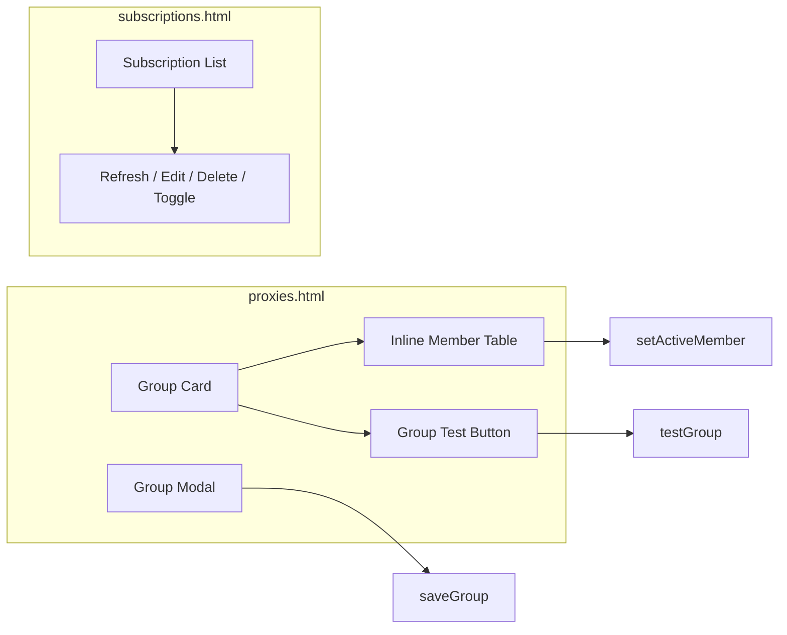

# subscription_group_ui_design.md

## 元数据

- 文档类型：Plan
- 版本：v0.1.2
- 所属项目：phaethon
- 创建日期：2026-07-14

## 变更记录

| 版本 | 日期 | 变更内容 | 作者 |
|------|------|----------|------|
| v0.1.0 | 2026-07-14 | 初始版本：订阅/代理组 UI 简化方案 | Claude |
| v0.1.1 | 2026-07-14 | 调整 Members 顺序为订阅节点在前、手动成员在后，明确兜底语义 | Claude |
| v0.1.2 | 2026-07-15 | 移除 static/dynamic 相关描述；明确保留 Group Modal 编辑 | Claude |

## 1. 背景与目标

当前 Admin UI 中：

- 订阅页面提供独立的“Nodes”弹窗和单节点测速。
- 代理组页面通过“Select Nodes”弹窗管理订阅节点，手动代理与订阅节点互斥。
- 健康检查入口分散：订阅页、代理组弹窗、手动成员 picker 中都有测速按钮。

简化目标：

1. 订阅页面只管理 URL/刷新/启用，不再展示节点测速。
2. 代理组页面直接平铺展示所有成员（手动 + 订阅）。
3. 每个代理组只有一个“测速”按钮，一键测试全部成员。
4. `select` 组支持点击节点设置当前活动节点；`best` / `load-balance` 按各自的策略自动选择。
5. 弹窗作为“高级筛选/批量选择”的可选入口。

## 2. 架构调整

### 2.1 后端

```mermaid
flowchart TD
    A[Admin UI] -->|GET /api/groups/{name}/members| B[admin.go: apiGroupMembers]
    A -->|POST /api/groups/{name}/test| C[admin.go: apiGroupTest]
    A -->|POST /api/groups/{name}/active-member| D[admin.go: apiGroupActiveMember]
    B --> E[config.ProxyGroup.Members]
    C --> F[main.go: checkProxyHealth / SetHealthImmediate]
    D --> G[更新 ManualProxies / SubscriptionSelected]
```

核心修改：

- `ProxyGroup.activeMembersLocked()` 从“有订阅就只返回订阅节点”改为始终返回合并后的 `Members`。
- 新增 `GET /api/groups/{name}/members` 统一返回平铺成员及其健康、激活状态。
- 新增 `POST /api/groups/{name}/test` 对所有成员执行一次性立即测速。
- 新增 `POST /api/groups/{name}/active-member` 供 `select` 组设置当前活动节点。
- 保留 `/api/groups/{name}/subscription` 供高级弹窗使用。

### 2.2 前端



页面变化：

- `proxies.html`：
  - Group Card 增加展开/折叠的成员表格。
  - 成员表格列：名称、类型、地址、健康状态、延迟、激活标记。
  - `select` 组行可点击设置 active；其他类型仅展示。
  - 删除“Select Nodes”主按钮，改为小字“高级筛选”。
  - **保留 Group Modal 作为编辑入口**，并去掉 manual/subscription 模式切换，改为同时可选 manual picker 与 subscription source。
- `subscriptions.html`：删除 `viewSubNodes` 与单节点测速按钮。
- `app.js`：`NodeViewer` 保留但不再作为默认入口，仅被“高级筛选”调用。

## 3. 关键设计决策

### ADR: 保留 Group Modal 而非平铺内联编辑

- **日期**: 2026-07-15
- **决策**: 保留弹窗编辑，并进一步简化弹窗内容；不改为内联编辑。
- **理由**:
  - 代理组表单字段较多（尤其是手动成员双栏选择器），内联展开会把单个组卡片撑得很高，与下方成员表格混在一起，视觉焦点和滚动体验都会变差。
  - 弹窗是成熟实现，改动风险小；重构的核心目标（成员平铺展示、active 与 membership 解耦）已经在卡片和成员表格中完成，不需要把编辑表单也平铺。
  - “平铺”在本次重构中的含义是**成员列表平铺**，而非**编辑表单平铺**。
- **替代方案**: 平铺内联编辑、侧边栏/抽屉编辑。

### 3.1 手动代理与订阅节点共存

运行时 `Members` = `SubMembers` + `ManualMembers`（订阅节点在前，手动成员在后）。`Next()` 的选择逻辑作用在 `Members` 上，因此：

- `select` 组中，若用户手动选择某个节点，该节点会被移到最前；否则按顺序取第一个存活节点。
- `best` / `load-balance` 在所有存活成员中选择，订阅节点优先被轮询/比较。
- 当订阅节点全部不可用时，手动代理（如 DIRECT）可作为兜底。

### 3.2 Active 标记计算

`GET /api/groups/{name}/members` 返回时，后端根据组类型计算 `active`：

- `select`：当前 `pickMember` 返回的成员。
- `best`：存活且延迟最低者。
- `load-balance`：当前轮询索引指向的存活成员（展示时取最近一次）。

### 3.3 健康状态展示

- 手动代理默认 `alive=true`，`latencyMs=0`，`lastCheck` 为空，直到被手动测速。
- 订阅节点显示最近健康检查状态。
- 组级测速对所有成员执行，结果写入 group healthMap。

### 3.4 弹窗降级为可选

保留 `NodeViewer` 与 `/api/groups/{name}/subscription`：

- 用于订阅节点数量很多时按正则过滤批量选择。
- 默认折叠，用户点击“高级筛选”才打开。
- 弹窗保存后刷新成员表格。

## 4. 接口时序

### 4.1 页面加载

```sequence
Browser->>Server: GET /proxies
Server-->>Browser: HTML + 初始 groups/proxies 数据
Browser->>Server: GET /api/groups/{name}/members
Server-->>Browser: 平铺成员列表
Browser->>Browser: 渲染成员表格
```

### 4.2 点击测速

```sequence
Browser->>Server: POST /api/groups/{name}/test
Server->>Server: 并发检查所有成员
Server-->>Browser: 健康快照
Browser->>Browser: 更新行状态与 active 标记
```

### 4.3 select 组设置活动节点

```sequence
Browser->>Server: POST /api/groups/{name}/active-member
Server->>Server: 调整 ManualProxies / SubscriptionSelected
Server->>Server: saveConfigLocked + mergeAndInitLocked
Server-->>Browser: {status: ok}
Browser->>Browser: 更新 active 高亮
```

## 5. 风险与回退

| 风险 | 影响 | 缓解 |
|------|------|------|
| 改变 activeMembersLocked 可能影响现有只配 subscription 的组 | 中 | 保持 `Members` = manual + subscription 顺序，手动在前；原有仅 subscription 组行为不变（manual 为空） |
| 前端一次性渲染大量节点性能差 | 中 | 成员表格默认只渲染前 50 条，其余折叠或分页 |
| 组级测速并发过大 | 低 | 复用现有并发限制（8），并在前端显示进度 |

## 6. 验收标准

- [ ] 订阅页面没有“Nodes”和单节点测速按钮。
- [ ] 代理组卡片可展开平铺成员列表。
- [ ] `select` 组点击行后刷新，该行变为 active。
- [ ] 点击组级“测速”后，所有成员行状态更新。
- [ ] `best` / `load-balance` 组在测速后自动更新 active 标记。
- [ ] 配置保存后 `/api/groups/{name}/members` 反映最新顺序与选中状态。
- [ ] Group Modal 保留弹窗形式，字段文案无 static/dynamic 残留。
- [ ] `go test ./...` 通过，`go build` 成功。
