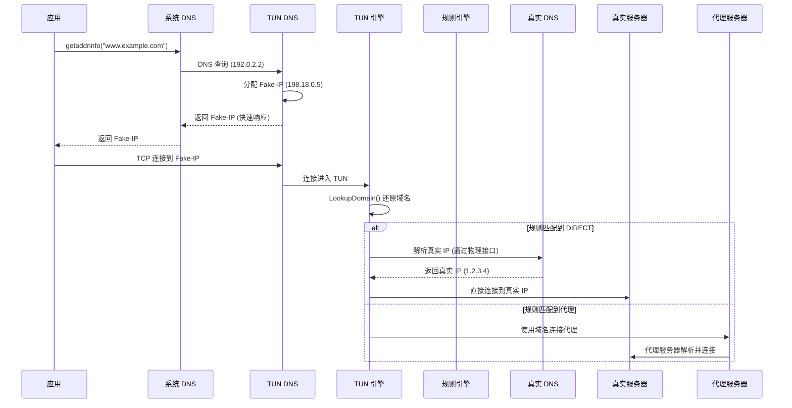

> 版本: v0.2.0
> 日期: 2026-08-29
> 状态: COMPLETED
> 负责人: Phaethon Dev

# TUN DNS 解析优化

## 变更记录

| 版本 | 日期 | 变更内容 | 作者 |
|------|------|----------|------|
| v0.1.0 | 2026-08-28 | 初始版本（DNS 时同步解析真实 IP） | Phaethon Dev |
| v0.2.0 | 2026-08-29 | 改为连接时解析（仅 DIRECT 规则） | Phaethon Dev |

## 1. 背景与目标

### 1.1 问题演进

**v0.1.0 方案（已废弃）**：DNS 时同步解析真实 IP
- 问题：所有域名都会解析真实 IP，包括走代理的域名
- 浪费：代理连接不需要真实 IP，但仍会解析
- 延迟：DNS 响应变慢（需要等待真实 IP 解析）

**v0.2.0 方案（当前）**：连接时按需解析真实 IP
- DNS 只返回 Fake-IP，不解析真实 IP
- 仅在规则匹配到 DIRECT 时，才在连接时解析真实 IP
- 代理连接直接使用域名，不解析真实 IP

### 1.2 目标

1. DNS 响应快速，只返回 Fake-IP
2. 真实 IP 解析只在必要时进行（DIRECT 规则）
3. 代理连接不解析真实 IP，直接使用域名
4. 看门狗使用更长的超时时间和更快的探测地址

## 2. 架构设计

### 2.1 当前流程（v0.2.0）



### 2.2 关键设计决策

**为什么不在 DNS 时解析真实 IP？**
1. 代理连接不需要真实 IP（代理服务器会自己解析）
2. DNS 时解析会增加所有查询的延迟
3. 很多域名最终走代理，解析真实 IP 是浪费

**为什么在连接时解析？**
1. 此时已经知道规则匹配结果
2. 只有 DIRECT 规则才需要真实 IP
3. 解析结果立即用于建立连接，无额外延迟

### 2.3 DNS 劫持器（简化）

```go
// tun/dns.go

func (h *DNSHijacker) serveLoop() {
    for {
        // 读取 DNS 查询
        domain, ok := parseDNSQueryDomain(packet)
        if !ok {
            continue
        }
        
        // 只分配 Fake-IP，不解析真实 IP
        fakeIP := h.pool.Lookup(domain)
        
        resp := buildDNSResponse(packet, fakeIP.To4())
        // 发送响应（快速）
    }
}
```

### 2.4 引擎连接处理

```go
// tun/engine.go

func (e *Engine) handleConn(conn net.Conn, dstAddr string, dstPort int) {
    // 从 Fake-IP 还原域名
    domain := e.fakeIP.LookupDomain(dstAddr)
    
    // 规则匹配
    req := config.NewConnectRequest(domain, dstPort)
    proxy := e.ruleConf.Match(req, nil)
    
    if proxy != nil && proxy.Type != config.ProxyDIRECT {
        // 代理连接：直接使用域名
        targetConn, _ = dialer.ChainDialWithID(proxy, domain, dstPort, connID)
    } else {
        // DIRECT 连接：此时才解析真实 IP
        ips, _ := net.LookupIP(domain)
        dialAddr := ips[0].String()
        targetConn, _ = dialer.DialRouteAware("tcp", net.JoinHostPort(dialAddr, port))
    }
}
```

## 3. 实现步骤

### 3.1 阶段一：DNS 劫持器简化（v0.2.0）

- [x] 移除 `DNSHijacker.serveLoop()` 和 `Resolve()` 中的真实 IP 解析
- [x] DNS 只返回 Fake-IP，不解析真实 IP
- [x] 移除 `FakeIPPool` 中的 `ipToRealIP` 缓存（不再需要）

### 3.2 阶段二：引擎连接时解析（v0.2.0）

- [x] 修改 `handleConn()` 和 `handleUDP()` 在连接时解析真实 IP
- [x] 仅对 DIRECT 规则解析真实 IP
- [x] 代理连接直接使用域名

### 3.3 阶段三：看门狗优化（v0.2.0）

- [x] 增加 HTTP 超时时间（8s → 15s）
- [x] 更换更快的探测地址（Cloudflare, Firefox）
- [x] 看门狗通过 TUN DNS 解析，测试完整流程

## 4. 风险与回退

| 风险 | 影响 | 缓解 |
|------|------|------|
| DIRECT 连接 DNS 解析慢 | 连接建立延迟 | 使用系统 DNS 缓存，通常很快 |
| DIRECT 连接 DNS 解析失败 | 连接失败 | 返回错误，应用可重试 |
| 看门狗误判 | TUN 重启 | 15s 超时 + 快速探测地址 |

## 5. 验收标准

- [x] `go build ./...`、`go vet ./tun`、`go test ./tun` 全部通过
- [x] TUN DNS 快速返回 Fake-IP，不解析真实 IP
- [x] DIRECT 连接在连接时解析真实 IP
- [x] 代理连接不解析真实 IP，直接使用域名
- [x] 看门狗稳定运行，无误重启

## 6. SetInterfaceDnsSettings 调研结论

在实现过程中调研了 `SetInterfaceDnsSettings` API 用于设置 TUN 接口 DNS。

**初期遇到的问题**：
- API 返回成功但不生效
- 尝试了不同的结构体布局、Flags 值、网卡类型，都不工作

**根本原因**：
1. **结构体布局错误** - `Flags` 字段是 `ULONG64` (64位)，不是 32 位
2. **Flags 未设置** - 必须设置 `DNS_SETTING_NAMESERVER (0x0002)` 标志位，告诉 API 我们要配置 `NameServer` 字段

**正确的结构体定义**：
```go
type interfaceDnsSettingsEx struct {
    Version             uint32
    _                   uint32 // padding to align Flags to 64-bit
    Flags               uint64 // ULONG64, not ULONG!
    Domain              *uint16
    NameServer          *uint16
    SearchList          *uint16
    RegistrationEnabled uint32
    RegisterAdapterName uint32
    EnableLLMNR         uint32
    QueryAdapterName    uint32
    ProfileNameServer   *uint16
}
```

**正确的调用方式**：
```go
settings := interfaceDnsSettingsEx{
    Version:    1,
    Flags:      DNS_SETTING_NAMESERVER, // 0x0002 - 必须设置！
    NameServer: serverUTF16,
}
```

**结论**：
- `SetInterfaceDnsSettings` API 工作正常，适用于所有网卡（包括 Wintun）
- 关键是使用正确的结构体布局和设置正确的 Flags
- 这是设置 DNS 的标准 Windows API，推荐使用

**参考文档**：
- https://learn.microsoft.com/en-us/windows/win32/api/netioapi/ns-netioapi-dns_interface_settings
- https://learn.microsoft.com/en-us/windows/win32/api/netioapi/nf-netioapi-setinterfacednssettings

## 7. 经验教训

### 7.1 调试过程回顾

**阶段 1：初步失败**
- 使用字节数组 `[48]byte` 模拟结构体
- 设置 `Flags=0`，`NameServer` 或 `DnsServer` 字段
- 结果：API 返回成功但不生效

**阶段 2：错误归因**
- 误认为是 Wintun 虚拟网卡的兼容性问题
- 尝试注册表 API 作为替代方案
- 注册表方案工作正常，但这不是根本解决方案

**阶段 3：深入调研**
- 用户质疑：Windows 不会提供不能用的 API
- 重新查阅 Microsoft 官方文档
- 发现关键信息：Flags 字段必须设置对应的标志位

**阶段 4：找到根因**
- 结构体布局错误：Flags 是 ULONG64 (64位)，不是 32 位
- Flags 未设置：必须设置 `DNS_SETTING_NAMESERVER (0x0002)`
- 修正后 API 工作正常

### 7.2 关键教训

**1. 仔细阅读 API 文档**
- 特别注意结构体字段的类型和大小
- 注意 Flags 字段的标志位定义
- 不要假设字段类型，必须查证

**2. 不要轻易归因于外部因素**
- 遇到问题时，先检查自己的实现
- "API 有 bug" 应该是最后的可能性，不是第一反应
- 用户质疑是正确的：Windows 不会提供不能用的 API

**3. 使用正确的工具调试**
- 用测试程序验证 API 调用
- 在不同环境下测试（不同网卡、不同 Windows 版本）
- 查阅官方文档和示例代码

**4. 结构体布局的重要性**
- Windows API 对结构体布局要求严格
- 字段类型、大小、对齐都必须正确
- 使用字节数组模拟结构体容易出错，应该使用正确的类型定义

**5. Flags 字段的常见陷阱**
- Flags=0 通常表示"不启用任何选项"
- 必须查阅文档了解每个标志位的含义
- 忘记设置 Flags 是常见的错误

### 7.3 最佳实践

**调用 Windows API 时的检查清单**：
- [ ] 结构体字段类型是否正确（特别是 ULONG vs ULONG64）
- [ ] 结构体字段顺序是否正确
- [ ] 是否需要 padding 对齐
- [ ] Flags 字段是否需要设置特定的标志位
- [ ] 版本字段是否需要设置特定的版本号
- [ ] 指针字段是否正确初始化
- [ ] 字符串是否为 NULL 终止的宽字符串

**调试策略**：
1. 先检查自己的实现，不要假设 API 有问题
2. 查阅官方文档，特别是 Remarks 和 Requirements 部分
3. 查找官方示例代码或第三方成功使用的案例
4. 用最小化测试程序验证 API 调用
5. 检查返回值和错误码的真实含义

### 7.4 技术细节

**DNS_INTERFACE_SETTINGS 结构体关键点**：
- `Version`: 必须设置为 `DNS_INTERFACE_SETTINGS_VERSION1` (1)
- `Flags`: ULONG64 类型，必须设置对应的标志位
  - `DNS_SETTING_NAMESERVER (0x0002)`: 配置 NameServer 字段
  - `DNS_SETTING_IPV6 (0x0001)`: 配置 IPv6 地址
  - 其他标志位参见文档
- `NameServer`: 空格或逗号分隔的 DNS 服务器地址列表

**常见错误**：
1. 使用 32 位 Flags 而不是 64 位
2. 忘记设置 Flags 标志位
3. 结构体字段顺序错误
4. 缺少必要的 padding 对齐
