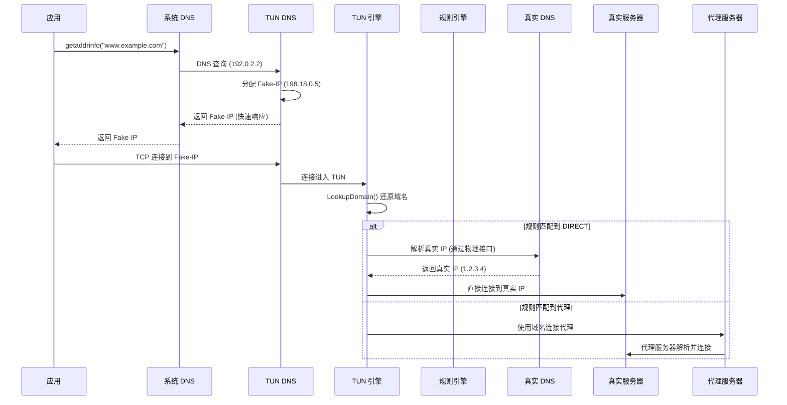

> 版本: v0.2.0
> 日期: 2026-08-29
> 状态: COMPLETED
> 负责人: Phaethon Dev

# TUN DNS 解析优化

## 变更记录

| 版本 | 日期 | 变更内容 | 作者 |
|------|------|----------|------|
| v0.1.0 | 2026-08-28 | 初始版本（DNS 时同步解析真实 IP） | Phaethon Dev |
| v0.2.0 | 2026-08-29 | 改为连接时解析（仅 DIRECT 规则） | Phaethon Dev |

## 1. 背景与目标

### 1.1 问题演进

**v0.1.0 方案（已废弃）**：DNS 时同步解析真实 IP
- 问题：所有域名都会解析真实 IP，包括走代理的域名
- 浪费：代理连接不需要真实 IP，但仍会解析
- 延迟：DNS 响应变慢（需要等待真实 IP 解析）

**v0.2.0 方案（当前）**：连接时按需解析真实 IP
- DNS 只返回 Fake-IP，不解析真实 IP
- 仅在规则匹配到 DIRECT 时，才在连接时解析真实 IP
- 代理连接直接使用域名，不解析真实 IP

### 1.2 目标

1. DNS 响应快速，只返回 Fake-IP
2. 真实 IP 解析只在必要时进行（DIRECT 规则）
3. 代理连接不解析真实 IP，直接使用域名
4. 看门狗使用更长的超时时间和更快的探测地址

## 2. 架构设计

### 2.1 当前流程（v0.2.0）



### 2.2 关键设计决策

**为什么不在 DNS 时解析真实 IP？**
1. 代理连接不需要真实 IP（代理服务器会自己解析）
2. DNS 时解析会增加所有查询的延迟
3. 很多域名最终走代理，解析真实 IP 是浪费

**为什么在连接时解析？**
1. 此时已经知道规则匹配结果
2. 只有 DIRECT 规则才需要真实 IP
3. 解析结果立即用于建立连接，无额外延迟

### 2.3 DNS 劫持器（简化）

```go
// tun/dns.go

func (h *DNSHijacker) serveLoop() {
    for {
        // 读取 DNS 查询
        domain, ok := parseDNSQueryDomain(packet)
        if !ok {
            continue
        }
        
        // 只分配 Fake-IP，不解析真实 IP
        fakeIP := h.pool.Lookup(domain)
        
        resp := buildDNSResponse(packet, fakeIP.To4())
        // 发送响应（快速）
    }
}
```

### 2.4 引擎连接处理

```go
// tun/engine.go

func (e *Engine) handleConn(conn net.Conn, dstAddr string, dstPort int) {
    // 从 Fake-IP 还原域名
    domain := e.fakeIP.LookupDomain(dstAddr)
    
    // 规则匹配
    req := config.NewConnectRequest(domain, dstPort)
    proxy := e.ruleConf.Match(req, nil)
    
    if proxy != nil && proxy.Type != config.ProxyDIRECT {
        // 代理连接：直接使用域名
        targetConn, _ = dialer.ChainDialWithID(proxy, domain, dstPort, connID)
    } else {
        // DIRECT 连接：此时才解析真实 IP
        ips, _ := net.LookupIP(domain)
        dialAddr := ips[0].String()
        targetConn, _ = dialer.DialRouteAware("tcp", net.JoinHostPort(dialAddr, port))
    }
}
```

## 3. 实现步骤

### 3.1 阶段一：DNS 劫持器简化（v0.2.0）

- [x] 移除 `DNSHijacker.serveLoop()` 和 `Resolve()` 中的真实 IP 解析
- [x] DNS 只返回 Fake-IP，不解析真实 IP
- [x] 移除 `FakeIPPool` 中的 `ipToRealIP` 缓存（不再需要）

### 3.2 阶段二：引擎连接时解析（v0.2.0）

- [x] 修改 `handleConn()` 和 `handleUDP()` 在连接时解析真实 IP
- [x] 仅对 DIRECT 规则解析真实 IP
- [x] 代理连接直接使用域名

### 3.3 阶段三：看门狗优化（v0.2.0）

- [x] 增加 HTTP 超时时间（8s → 15s）
- [x] 更换更快的探测地址（Cloudflare, Firefox）
- [x] 看门狗通过 TUN DNS 解析，测试完整流程

## 4. 风险与回退

| 风险 | 影响 | 缓解 |
|------|------|------|
| DIRECT 连接 DNS 解析慢 | 连接建立延迟 | 使用系统 DNS 缓存，通常很快 |
| DIRECT 连接 DNS 解析失败 | 连接失败 | 返回错误，应用可重试 |
| 看门狗误判 | TUN 重启 | 15s 超时 + 快速探测地址 |

## 5. 验收标准

- [x] `go build ./...`、`go vet ./tun`、`go test ./tun` 全部通过
- [x] TUN DNS 快速返回 Fake-IP，不解析真实 IP
- [x] DIRECT 连接在连接时解析真实 IP
- [x] 代理连接不解析真实 IP，直接使用域名
- [x] 看门狗稳定运行，无误重启

## 6. SetInterfaceDnsSettings 调研结论

在实现过程中调研了 `SetInterfaceDnsSettings` API 用于设置 TUN 接口 DNS。

**初期遇到的问题**：
- API 返回成功但不生效
- 尝试了不同的结构体布局、Flags 值、网卡类型，都不工作

**根本原因**：
1. **结构体布局错误** - `Flags` 字段是 `ULONG64` (64位)，不是 32 位
2. **Flags 未设置** - 必须设置 `DNS_SETTING_NAMESERVER (0x0002)` 标志位，告诉 API 我们要配置 `NameServer` 字段

**正确的结构体定义**：
```go
type interfaceDnsSettingsEx struct {
    Version             uint32
    _                   uint32 // padding to align Flags to 64-bit
    Flags               uint64 // ULONG64, not ULONG!
    Domain              *uint16
    NameServer          *uint16
    SearchList          *uint16
    RegistrationEnabled uint32
    RegisterAdapterName uint32
    EnableLLMNR         uint32
    QueryAdapterName    uint32
    ProfileNameServer   *uint16
}
```

**正确的调用方式**：
```go
settings := interfaceDnsSettingsEx{
    Version:    1,
    Flags:      DNS_SETTING_NAMESERVER, // 0x0002 - 必须设置！
    NameServer: serverUTF16,
}
```

**结论**：
- `SetInterfaceDnsSettings` API 工作正常，适用于所有网卡（包括 Wintun）
- 关键是使用正确的结构体布局和设置正确的 Flags
- 这是设置 DNS 的标准 Windows API，推荐使用

**参考文档**：
- https://learn.microsoft.com/en-us/windows/win32/api/netioapi/ns-netioapi-dns_interface_settings
- https://learn.microsoft.com/en-us/windows/win32/api/netioapi/nf-netioapi-setinterfacednssettings

## 7. 经验教训（泛化原则）

### 7.1 核心问题模式

**模式 1：表面归因陷阱**
- 现象：遇到问题时，倾向于归因于外部因素（API bug、驱动问题、系统限制）
- 实例：SetInterfaceDnsSettings 不工作 → 认为是 Wintun 兼容性问题
- 根因：没有先彻底检查自己的实现
- 原则：**永远先假设是自己的错，直到证明不是**

**模式 2：文档阅读不充分**
- 现象：快速浏览文档，凭印象实现，忽略关键细节
- 实例：看到结构体定义就实现，没注意 Flags 是 64 位、需要设置标志位
- 根因：急于求成，假设自己理解了
- 原则：**逐字逐句阅读 API 文档，特别是 Remarks、Requirements、示例**

**模式 3：捷径思维**
- 现象：选择看似简单的实现方式，避免"复杂"的正确方式
- 实例：用字节数组模拟结构体，而不是定义正确的类型
- 根因：懒惰，低估了正确实现的重要性
- 原则：**选择正确的方式，而不是简单的方式**

**模式 4：过早放弃**
- 现象：尝试几次失败后，快速转向替代方案
- 实例：SetInterfaceDnsSettings 失败几次后，转向注册表 API
- 根因：缺乏深入调查的耐心和决心
- 原则：**在放弃之前，确保已经穷尽了所有可能性**

**模式 5：验证不充分**
- 现象：测试不够全面，过早下结论
- 实例：只在一块网卡上测试，就认为是普遍问题
- 根因：测试策略不系统
- 原则：**在多个环境、多个场景下验证，才能下结论**

### 7.2 通用调试原则

**原则 1：奥卡姆剃刀**
- 最简单的解释往往是正确的
- "API 有 bug" 是复杂的解释，"我用错了" 是简单的解释
- 优先检查简单的解释

**原则 2：控制变量法**
- 一次只改变一个变量
- 系统地排除可能性
- 不要同时改变多个东西然后猜测原因

**原则 3：最小化复现**
- 创建最小化测试程序验证问题
- 排除其他因素的干扰
- 确保问题是可复现的

**原则 4：查阅权威来源**
- 官方文档 > 第三方博客 > 自己的猜测
- 查找官方示例代码
- 查找其他成功使用的案例

**原则 5：质疑自己的假设**
- 列出所有的假设
- 逐一验证每个假设
- 不要认为"显然"的东西就一定是对的

### 7.3 代码实现检查清单

**每次调用外部 API 前**：
- [ ] 是否完整阅读了 API 文档？
- [ ] 结构体字段类型是否正确（大小、符号、对齐）？
- [ ] 是否需要设置 Flags/Version 等控制字段？
- [ ] 是否有官方示例可以参考？
- [ ] 是否在其他项目中看到过成功的使用？

**遇到问题时**：
- [ ] 是否检查了自己的实现？（而不是先怪外部）
- [ ] 是否创建了最小化测试程序？
- [ ] 是否在不同环境下测试过？
- [ ] 是否查阅了官方文档的 Remarks 部分？
- [ ] 是否穷尽了所有可能性才考虑替代方案？

**选择实现方案时**：
- [ ] 是否选择了正确的方式（而不是简单的方式）？
- [ ] 是否考虑了长期维护性？
- [ ] 是否避免了不必要的 workaround？
- [ ] 是否理解了方案背后的原理？

### 7.4 心理陷阱

**确认偏误**：
- 一旦形成假设，就倾向于寻找支持证据
- 解决方法：主动寻找反驳证据

**沉没成本谬误**：
- 已经在某个方向投入太多，不愿意转向
- 解决方法：定期评估，勇于转向

**达克效应**：
- 对自己不熟悉领域的难度估计不足
- 解决方法：保持谦逊，承认无知

**权威偏误**：
- 认为"官方 API 不可能有问题"
- 解决方法：保持怀疑，但要基于证据

### 7.5 本次案例的具体教训

**技术层面**：
- Windows API 结构体布局必须严格匹配（类型、大小、对齐）
- Flags 字段通常需要设置特定的标志位
- 使用正确的类型定义，不要用字节数组模拟

**流程层面**：
- 用户质疑是正确的：不要过早归因于外部因素
- 深入调研比快速转向更有价值
- 官方文档是关键，必须仔细阅读

**态度层面**：
- 承认错误，勇于纠正
- 保持好奇心，追根溯源
- 把每次错误都当作学习机会

## 8. 其他平台 Shell 命令 API 化（待办）

Windows 平台已完成全部 shell 命令替换（~33 处 exec.Command → 原生 Windows API），
Darwin 和 Linux 平台仍有残留，待后续处理。

### 8.1 Darwin (macOS)

| 文件 | 调用数 | 命令 | 说明 |
|------|--------|------|------|
| `route_darwin.go` | 10 | ifconfig, route, netstat | 接口配置、路由增删、网关查询 |
| `dns_system_darwin.go` | 4 | networksetup | DNS 设置/恢复/查询 |
| `cleanup_darwin.go` | 3 | route, ifconfig | 残留路由清理、接口禁用 |

**可参考的 macOS 原生 API**：
- 路由/接口：`sysctl` net.route / net.interface（通过 `syscall.Sysctl` 或 CGo 调用 `route(4)`）
- DNS：`SCDynamicStore` / `SCNetworkConfiguration` framework（SystemConfiguration.framework）
- 接口管理：`if_nametoindex` + `ioctl` (SIOCAIFADDR / SIOCDIFADDR)

### 8.2 Linux

| 文件 | 调用数 | 命令 | 说明 |
|------|--------|------|------|
| `dns_system_linux.go` | 4 | resolvectl, nmcli | DNS 设置/恢复 |
| `cleanup_linux.go` | 1 | ip link | 接口禁用 |

**可参考的 Linux 原生 API**：
- DNS：直接写 `/etc/resolv.conf`（最简单）或 `systemd-resolved` D-Bus API
- 路由/接口：`netlink` 协议（通过 `vishvananda/netlink` 库或 `syscall` 直接调用）
- 接口管理：`ioctl` (SIOCSIFADDR / SIOCSIFFLAGS)

### 8.3 优先级

1. **低优先级**：Darwin/Linux 的 shell 调用不像 Windows netsh 那样受系统语言影响
2. **可选改进**：如果后续遇到性能或可靠性问题，再逐步 API 化
3. **保持一致性**：如果要做，三个平台统一完成，避免维护负担
