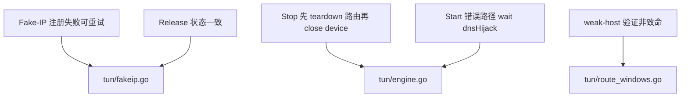

# TUN 路由与 Fake-IP 修复

## 元数据

- 文档类型：Plan
- 版本：v0.1.0
- 所属项目：phaethon
- 创建日期：2026-08-27

## 变更记录

| 版本 | 日期 | 变更内容 | 作者 |
|------|------|----------|------|
| v0.1.0 | 2026-08-27 | 初始版本 | Claude |

## 1. 背景与目标

### 1.1 当前问题

在 `a4b3c67` 提交完成 TUN 稳定性修复后，代码审查仍发现以下问题：

1. **Fake-IP 注册失败会永久假注册**：`fakeip.go:registerIPLocked()` 在调用 `AddProtocolAddress()` 之前就把 IP 标记为 `registered`，如果注册失败，该 Fake-IP 再也不会被重试注册，导致对应连接在 netstack 中无法触发 forwarder。
2. **Stop() 路由清理顺序偏晚**：`engine.go:Stop()` 先 `device.Close()` 再 `routeMgr.Teardown()`，适配器被删除后依赖 LUID 的路由删除可能失效，只能依赖下次启动时的 `CleanupResidual()`。
3. **weak-host 验证对非中英系统太严格**：`route_windows.go:ensureWeakHostEnabled()` 的查询/验证逻辑只识别中英文 `netsh` 输出，其他语言系统会验证失败并导致 TUN 启动失败。
4. **FakeIPPool.Release() 状态不一致**：`fakeip.go:Release()` 无论 `RemoveAddress()` 是否成功都会 `delete(registered)`，导致内存状态与 netstack 实际状态不一致。
5. **Start() 错误路径未等待 dnsHijack goroutine**：`engine.go` 中路由 setup 失败等错误路径只调用 `dnsHijack.Stop()`，未 `wg.Wait()`，goroutine 可能在函数返回后仍在访问已关闭资源。

### 1.2 目标

1. 修复 Fake-IP 注册失败后的重试问题。
2. 调整 Stop() 顺序，在删除适配器前先清理路由。
3. 将 weak-host 验证失败降级为警告，不阻断 TUN 启动。
4. 保证 `Release()` 中 `registered` map 与 netstack 状态一致。
5. 在 Start() 错误路径中正确等待 dnsHijack goroutine。

## 2. 架构调整

### 2.1 后端

本次修复不涉及架构变更，仅针对现有实现的缺陷进行修补。

## 3. 关键设计决策

### 3.1 Fake-IP 注册失败重试

将 `registered[ipStr] = true` 的写入时机从注册前改为 `AddProtocolAddress()` 成功后。失败时不写入，下次 `Lookup()` 同一个 domain 时会再次尝试注册。这样 transient 错误（如 gVisor 内部临时状态）可以自愈。

### 3.2 Stop() 路由清理顺序

将 `routeMgr.Teardown()` 提前到 `device.Close()` 之前：

1. restore system DNS
2. stop DNS proxy
3. **routeMgr.Teardown()** — 此时 adapter 仍在，LUID/index 有效
4. close device
5. wg.Wait()
6. stop dnsHijack / close netstack

### 3.3 weak-host 验证降级

`ensureWeakHostEnabled()` 仍会尝试设置 weak-host send/receive，并尝试查询验证。但查询失败或验证不通过时只记录 warning，不再返回 error。设置命令本身失败仍返回 error（这是 netsh 执行失败，与语言无关）。

### 3.4 Release() 一致性

`Release()` 中仅当 `RemoveAddress()` 成功后才 `delete(p.registered, ipStr)`。失败时保持 registered 状态，避免后续重复注册时 netstack 实际地址仍存在但内存认为已释放。

### 3.5 Start() 错误路径 goroutine 清理

在 `engine.go` 中所有调用 `dnsHijack.Stop()` 的错误路径后追加 `e.wg.Wait()`，确保 serve goroutine 在返回前已退出，再关闭 device/netstack。

## 4. 接口/交互调整

无。

## 5. 迁移与兼容性

- 所有修复向后兼容，不影响配置文件或 Admin API。
- Stop() 顺序调整只影响关闭时的清理可靠性，不暴露新接口。
- weak-host 验证降级后，非中英 Windows 系统也能正常启动 TUN。

## 6. 风险与回退

| 风险 | 影响 | 缓解 |
|------|------|------|
| Stop() 顺序调整后仍偶发残留路由 | 低 | `CleanupResidual()` 仍会在下次 Start() 兜底 |
| Fake-IP 重试注册导致重复日志 | 低 | 仅在注册失败场景出现，且每次失败都会打 warn |
| Release() 失败后未清理 registered | 低 | 下次 Lookup 同一 domain 会复用该 IP，再次 Release 时重试 |

## 7. 验收标准

- [ ] `fakeip.go:registerIPLocked()` 仅在 `AddProtocolAddress()` 成功后写入 `registered`。
- [ ] `engine.go:Stop()` 中 `routeMgr.Teardown()` 在 `device.Close()` 之前执行。
- [ ] `route_windows.go:ensureWeakHostEnabled()` 验证失败不返回 error。
- [ ] `fakeip.go:Release()` 仅在 `RemoveAddress()` 成功后删除 `registered`。
- [ ] `engine.go` Start() 错误路径在 `dnsHijack.Stop()` 后调用 `wg.Wait()`。
- [ ] `go build ./...`、`go vet ./tun`、`go test ./tun` 通过。
