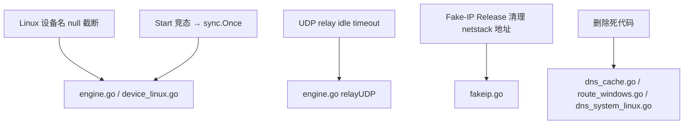

# TUN 稳定性修复

## 元数据

- 文档类型：Plan
- 版本：v0.1.0
- 所属项目：phaethon
- 创建日期：2026-08-27

## 变更记录

| 版本 | 日期 | 变更内容 | 作者 |
|------|------|----------|------|
| v0.1.0 | 2026-08-27 | 初始版本 | Qoder |

## 1. 背景与目标

### 1.1 当前问题

TUN 模块经过多轮迭代已具备完整功能，但代码审查发现以下稳定性和资源泄漏问题：

1. **Linux TUN 设备名包含 null 字节**：`device_linux.go` 中 `string(ifr.name[:])` 将 `[16]byte` 整体转为字符串，包含尾部 null 填充字节，导致路由命令和 netlink 查询使用错误的设备名。
2. **`Engine.Start()` 竞态条件**：`running` 标志在锁外设置（检查在锁内，赋值在锁外），两个并发 `Start()` 可同时通过检查，创建重复设备和路由。
3. **UDP relay 无超时**：`relayUDP()` 两端连接均无 deadline，远端无响应时 goroutine 永远挂起，长期运行会泄漏大量 goroutine。
4. **Fake-IP 地址在 netstack 中只注册不清理**：每次分配 Fake-IP 调用 `AddProtocolAddress()`，但 `Release()` 从不调用 `RemoveProtocolAddress()`，长期运行后 netstack 积累大量无用本地地址。
5. **死代码**：`DNSCache`（从未被调用）、`verifyStaticNeighbor()`、`isSystemdResolvedActive()` 应清理。

### 1.2 目标

1. 修复 Linux TUN 设备名 null 字节问题。
2. 消除 `Engine.Start()` 竞态条件。
3. 为 UDP relay 添加 idle timeout，防止 goroutine 泄漏。
4. Fake-IP `Release()` 时同步清理 netstack 本地地址注册。
5. 删除不再使用的死代码。

## 2. 架构调整

### 2.1 后端

本次修复不涉及架构变更，仅针对现有实现的缺陷进行修补。

## 3. 关键设计决策

### 3.1 Start() 竞态修复方式：改用初始化锁

不引入 `sync.Once`（因为 Start 需要返回 error），改为在整个初始化过程中持有 `mu` 锁。`running` 在初始化成功时设为 `true`，失败时保持 `false`。这样两个并发 Start() 调用中第二个会被阻塞直到第一个完成。

### 3.2 UDP relay timeout 策略

使用 30 秒 idle timeout。任一端 Read 超过 30 秒无数据则退出 relay。选择 30 秒是因为：
- DNS 查询通常 <1 秒
- QUIC 初始握手 <5 秒
- 30 秒足够覆盖大多数正常 UDP 交互的间隙
- 不会过于激进地断开低频但合法的 UDP 流

### 3.3 Fake-IP 地址清理策略

在 `Release()` 中调用 `RemoveProtocolAddress()` 移除 netstack 本地地址。由于 `Release()` 当前实际上未被调用（没有连接关闭回调），真正减少地址积累需要配合 TCP/UDP 连接关闭时触发 Release。但本次仅修复 Release 本身的清理逻辑，不做连接生命周期集成的大改动。

同时移除 `Lookup()` 中对 `registerIPLocked` 的重复调用——已注册过的 IP 不需要每次 Lookup 时再尝试注册。

## 4. 接口/交互调整

无。

## 5. 迁移与兼容性

- 所有修复向后兼容，不影响配置文件或 Admin API。
- Linux 设备名修复使路由配置能正确工作，属于 bug fix。
- UDP timeout 可能导致极慢速 UDP 流被断开，但 30 秒 idle 对正常应用无影响。

## 6. 风险与回退

| 风险 | 影响 | 缓解 |
|------|------|------|
| Start() 持锁时间变长 | 低 | 初始化本身是串行的，持锁不影响性能 |
| UDP 30s timeout 断开合法慢速流 | 低 | DNS/QUIC 等常见 UDP 协议远快于此阈值 |
| RemoveProtocolAddress 失败 | 低 | 仅 log warn，不影响功能 |

## 7. 验收标准

- [ ] Linux 上 `CreateDevice()` 返回的设备名不含 null 字节。
- [ ] 并发调用 `Start()` 不会创建重复设备（第二个返回 error）。
- [ ] UDP relay 在无数据 30 秒后自动退出。
- [ ] `FakeIPPool.Release()` 调用后 netstack 中对应地址被移除。
- [ ] `DNSCache`、`verifyStaticNeighbor`、`isSystemdResolvedActive` 死代码已删除。
- [ ] `go build ./...` 和 `go vet ./tun` 通过。
