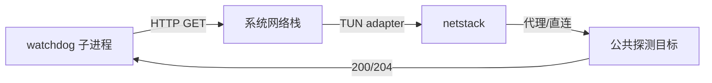

> 版本: v0.1.0
> 日期: 2026-08-27
> 状态: ACTIVE
> 负责人: Phaethon Dev

# TUN Watchdog HTTP 连通性探测改造

## 变更记录

| 版本 | 日期 | 变更内容 | 作者 |
|------|------|----------|------|
| v0.1.0 | 2026-08-27 | 初始版本 | Phaethon Dev |

## 1. 背景与目标

### 1.1 当前问题

当前 TUN watchdog（`main_tun.go:runWatchdog()`）通过 `tun.ProbeTUNDNS()` 每 5 秒探测一次 `192.0.2.2:53`，使用随机 `.local` 域名验证本地 DNS hijacker 是否返回 Fake-IP。这种探测只能证明：

- 系统 DNS 已指向 TUN adapter
- netstack 内部 DNS hijacker 还在运行

但它**无法证明** TUN 真的能帮用户连上外网。实际中可能出现：

- 路由表被其他软件覆盖，流量不再走 TUN
- 代理上游断开，TUN 收了包但发不出去
- 只有 DNS 能解析，TCP/HTTP 实际不通

### 1.2 目标

1. watchdog 通过真实 HTTP 请求验证 TUN 网络是否真正可用。
2. 探测目标可配置，默认使用高可用公共 portal，并支持 fallback。
3. TUN 启动后 watchdog 立即开始探测，无需 grace period。
4. 一旦连续探测失败达到阈值，立即 kill 父进程并清理 TUN 残留。
5. 保持现有“父进程死亡/接口消失”监控不变。

## 2. 架构调整

### 2.1 探测流程



由于 watchdog 是独立子进程，它发出的请求会真实经过完整的 TUN 链路，因此能同时验证：TUN 捕获、DNS proxy、netstack 转发、代理/直连出站、目标服务器可达性。

### 2.2 候选探测地址

经本地 curl 验证可达：

| URL | 响应 | 状态 |
|-----|------|------|
| `http://www.msftconnecttest.com/connecttest.txt` | `Microsoft Connect Test` | ✅ 默认首选 |
| `http://connectivitycheck.platform.hicloud.com/generate_204` | 204 No Content | ✅ fallback |
| `http://wifi.vivo.com.cn/generate_204` | 204 No Content | ✅ fallback |

探测时遍历候选列表，任一成功即视为网络正常；全部失败才计入一次探测失败。

## 3. 关键设计决策

### 3.1 使用 HTTP GET 而非 DNS probe

DNS probe 只能验证本地 hijacker 还活着，不能验证真实出网能力。HTTP GET 能覆盖 DNS、TCP、代理链路、目标服务四个层面。

### 3.2 多地址 fallback

单一公共地址可能在特定网络环境下被限制。使用多个 captive portal 地址作为 fallback，显著降低误杀概率。

### 3.3 激进失败策略

用户明确要求“不怕误杀，就怕不杀”。因此：

- 无 grace period
- 探测间隔 3 秒
- 连续失败 2 次即 kill + cleanup
- 最坏情况下 6 秒内触发清理

### 3.4 保留 DNS probe 作为辅助

原有 `ProbeTUNDNS()` 不删除，仅作为内部诊断手段；watchdog 的 kill 决策不再依赖它。

## 4. 接口/交互调整

### 4.1 配置字段

`config/config.go` 中 `TUNConfig` 增加：

```go
ProbeURLs []string `yaml:"probe-urls,omitempty" json:"probe-urls,omitempty"`
```

`conf/default.yaml` 同步增加：

```yaml
tun:
  enabled: false
  probe-urls: []
```

### 4.2 Admin API 状态字段

`GET /api/tun` 返回中增加：

```json
{
  "probeURLs": ["..."]
}
```

probe 失败次数由 watchdog 子进程写入自身日志（`phaethon-watchdog.log`），用于事后排查。

## 5. 迁移与兼容性

- 未配置 `probe-urls` 时使用默认候选列表，行为不变。
- 显式配置 `probe-urls: []` 时，回退到原有 DNS probe 模式（保持兼容）。
- 现有 watchdog 的时间参数和 kill 逻辑调整，但清理动作不变。

## 6. 风险与回退

| 风险 | 影响 | 缓解 |
|------|------|------|
| 默认探测地址在特定网络下不可达 | 误杀 | 多地址 fallback + 用户可配置 |
| HTTP 探测频率过高 | 低 | 间隔 3 秒，请求量极小 |
| 用户未配置且所有默认地址失效 | 高 | 提供显式关闭 HTTP probe 的兼容模式 |

## 7. 验收标准

- [ ] `go build ./...`、`go vet ./tun`、`go test ./tun` 全部通过
- [ ] 正常 TUN 启动后，watchdog 立即开始 HTTP 探测
- [ ] 模拟代理上游断开：连续 2 次失败后 watchdog kill 父进程并清理 TUN
- [ ] 用户自定义 `probe-urls` 后，watchdog 使用自定义地址
- [ ] Admin API `/api/tun` 正确返回 `probeURLs` 和 `probeFailures`
