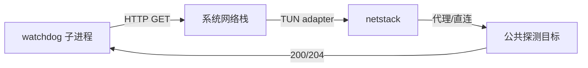

> 版本: v0.8.0
> 日期: 2026-08-29
> 状态: ACTIVE
> 负责人: Phaethon Dev

# TUN Watchdog HTTP 连通性探测改造

## 变更记录

| 版本 | 日期 | 变更内容 | 作者 |
|------|------|----------|------|
| v0.1.0 | 2026-08-27 | 初始版本 | Phaethon Dev |
| v0.2.0 | 2026-08-27 | 统一全平台使用 HTTP probe；移除 DNS probe fallback；仅使用接口索引绑定 | Phaethon Dev |
| v0.3.0 | 2026-08-28 | Windows 接口绑定方案改为 bind() 到接口本地 IP；新增多 IP 选取规则 | Phaethon Dev |
| v0.4.0 | 2026-08-28 | 记录已否决的 netstack 出站方案；记录 shell 命令替换 API 的调研结论 | Phaethon Dev |
| v0.5.0 | 2026-08-28 | 新增 3.8 节：watchdog DNS 解析改用纯 Go 实现以避免系统调用线程阻塞 | Phaethon Dev |
| v0.6.0 | 2026-08-28 | 实现纯 Go DNS 解析器；分离 DNS/HTTP 超时参数；Admin API 新增 `stats` 字段（包计数器 + FakeIP 池统计） | Phaethon Dev |
| v0.7.0 | 2026-08-29 | watchdog 接口索引改为动态查询（按适配器名称），移除 `LAYER_WATCHDOG_TUN_IFINDEX` 环境变量 | Phaethon Dev |
| v0.8.0 | 2026-08-29 | 修正 3.8 节 DNS 解析方案：`PreferGo: true` 会绕过 TUN DNS hijacker，改为 `PreferGo: false`；调整超时参数（probeInterval 3s→10s，httpTimeout 15s→30s，probeFailLimit 2→3） | Phaethon Dev |

## 1. 背景与目标

### 1.1 当前问题

TUN watchdog 需要验证 TUN 是否真正可用，而不仅仅是本地 DNS hijacker 还活着。此前曾考虑保留 DNS probe 作为 Windows 降级方案，但 DNS probe 只能证明：

- 系统 DNS 已指向 TUN adapter
- netstack 内部 DNS hijacker 还在运行

它**无法证明** TUN 真的能帮用户连上外网。实际中可能出现：

- 路由表被其他软件覆盖，流量不再走 TUN
- 代理上游断开，TUN 收了包但发不出去
- 只有 DNS 能解析，TCP/HTTP 实际不通

### 1.2 目标

1. watchdog 通过真实 HTTP 请求验证 TUN 网络是否真正可用。
2. 探测目标可配置，默认使用高可用公共 portal，并支持 fallback。
3. TUN 启动后 watchdog 立即开始探测，无需 grace period。
4. 一旦连续探测失败达到阈值，立即 kill 父进程并清理 TUN 残留。
5. 保持现有“父进程死亡/接口消失”监控不变。
6. **统一全平台使用 HTTP probe，不再保留 DNS probe fallback。**

## 2. 架构调整

### 2.1 探测流程



由于 watchdog 是独立子进程，它发出的请求会真实经过完整的 TUN 链路，因此能同时验证：TUN 捕获、DNS proxy、netstack 转发、代理/直连出站、目标服务器可达性。

### 2.2 候选探测地址

默认候选列表（`DefaultProbeURLs`）：

| URL | 响应 | 状态 |
|-----|------|------|
| `http://cp.cloudflare.com/generate_204` | 204 No Content | ✅ 默认首选 |
| `http://detectportal.firefox.com/success.txt` | `success` | ✅ fallback |
| `http://www.msftconnecttest.com/connecttest.txt` | `Microsoft Connect Test` | ✅ fallback |

探测时遍历候选列表，任一成功即视为网络正常；全部失败才计入一次探测失败。

## 3. 关键设计决策

### 3.1 使用 HTTP GET 而非 DNS probe

DNS probe 只能验证本地 hijacker 还活着，不能验证真实出网能力。HTTP GET 能覆盖 DNS、TCP、代理链路、目标服务四个层面。

### 3.2 多地址 fallback

单一公共地址可能在特定网络环境下被限制。使用多个 captive portal 地址作为 fallback，显著降低误杀概率。

### 3.3 失败策略

初始设计采用激进策略（3 秒间隔、2 次失败即 kill），但实测发现 TUN 链路（DNS hijacker → netstack → proxy → 出站）在代理场景下需要较长时间完成连接。调整为：

- 无 grace period
- 探测间隔 10 秒
- 连续失败 3 次即 kill + cleanup
- 最坏情况下 30 秒内触发清理
- HTTP 超时 30 秒（覆盖代理连接 + 目标响应）
- DNS 超时 5 秒

### 3.4 强制探测流量走 TUN（接口绑定方案）

为避免 Windows 源地址选择、DNS 缓存或路由表被其他软件改动后看门狗探测绕过 TUN，watchdog 的 HTTP socket **必须绑定到 TUN 接口**。同样，dialer 的出站 socket 必须绑定到正确的物理接口以防止路由环。

#### 3.4.1 Windows 接口绑定方案实测结论

经多轮实测验证，各方案在 Windows 上的表现如下：

**测试环境**：物理网卡（以太网, idx=7）、VMware 虚拟网卡（VMnet1/8）、Wintun 虚拟网卡（phaethontun, idx=21）。

**方案一：`syscall.Bind` 在 Control 回调中**

| 接口类型 | 结果 |
|----------|------|
| 物理网卡 | ❌ FAIL: "bind: An invalid argument was supplied" |
| VMware 虚拟网卡 | ❌ FAIL: 同上 |
| Wintun 虚拟网卡 | ❌ FAIL: 同上 |

**根因**：Go 的 `net.Dialer` 在 Windows 上的实现会在 Control 回调之后再次调用 `bind()`（如果设置了 `LocalAddr`），导致 double-bind 失败。即使不设置 `LocalAddr`，实测仍然失败——`syscall.Bind` 在 Control 回调中对**所有接口类型**都无效。

**方案二：`net.Dialer.LocalAddr` 绑定源 IP**

| 接口类型 | 结果 |
|----------|------|
| 物理网卡 | ✅ connect 成功 |
| VMware 虚拟网卡 | ❌ FAIL: "unreachable network"（无路由，预期行为） |
| Wintun 虚拟网卡 | ❌ FAIL: "connection aborted by software" |

**根因**：Windows 使用**弱主机模型**（weak host model），路由选择仅基于目标 IP 最长前缀匹配，**源 IP 不约束路由决策**。设置 `LocalAddr` 为物理网卡 IP，但目标路由指向 TUN 时，连接会失败或路由环。

**方案三：`IP_UNICAST_IF`（setsockopt, IPPROTO_IP, optname=31）**

| 接口类型 | setsockopt | connect | 结论 |
|----------|------------|---------|------|
| 物理网卡 | ✅ 成功 | ✅ 成功 | **可用** |
| VMware 虚拟网卡 | ✅ 成功 | ❌ unreachable（无路由） | **可用**（连接失败是因为无路由，非绑定问题） |
| Wintun 虚拟网卡 | ✅ 成功 | ❌ timeout（无路由） | **可用**（同上） |

**关键发现**：`IP_UNICAST_IF` 的 `setsockopt` 调用对**所有接口类型都成功**，包括 Wintun。之前认为"对虚拟网卡报 10049"是误判——实际测试中 setsockopt 从未失败，连接失败是因为虚拟网卡没有到目标的路由，这是正确的行为。

**结论**：**统一使用 `IP_UNICAST_IF`**。该方案：
- 对所有接口类型有效（物理、VMware、Wintun、TAP 等）
- 在 Control 回调中通过 `setsockopt` 设置，不涉及 `bind()` 调用
- 接口索引需转为网络字节序（`htonl`）
- WireGuard-go 也采用相同方案（仅绑物理网卡）

#### 3.4.2 ~~已否决方案~~：Windows 改用 `bind()` 到接口本地 IP

> **⚠️ 此方案已否决**。实测发现 Windows 弱主机模型下，`bind()` 到源 IP **不能约束路由决策**。设置 `LocalAddr` 为物理网卡 IP，但目标路由指向 TUN 时，连接仍会失败或路由环。详见 3.4.1 方案二的实测结果。

~~**方案**：获取目标接口的本地 IP 地址，通过 `bind()` 将 socket 源地址绑定到该 IP。Windows 路由栈在出站路由查找时，会以绑定的源 IP 为约束，只考虑拥有该 IP 的路由。~~

~~**优势**：~~
- ~~工作在 IP 层，不依赖链路层，对所有接口类型有效。~~
- ~~只要 IP 唯一属于该接口，出站路径就是确定性的。~~

**正确方案**：使用 `IP_UNICAST_IF`（详见 3.4.1 结论）。

#### 3.4.3 接口索引选取规则

`IP_UNICAST_IF` 接受接口索引（网络字节序）作为参数。接口索引由 `bestRouteIndex()`（dialer）或动态查询（watchdog）提供。

**dialer 出站绑定**：通过 `GetBestRoute2` 查询到目标 IP 的最佳路由，排除 TUN LUID，返回物理接口索引。若最佳路由指向 TUN，回退到默认物理接口。

**watchdog 探测绑定**：watchdog 子进程通过适配器名称 `"phaethontun"` 动态查询当前接口索引（`net.InterfaceByName`）。不再使用父进程传入的静态环境变量，避免 TUN 适配器重建后绑定到残余接口索引导致探测失败和误杀。

**多 IP 接口**：一个接口可能有多个 IP，但 `IP_UNICAST_IF` 绑定的是接口索引而非 IP，因此无需 IP 选取逻辑。系统会自动在该接口上选择合适的源 IP。

#### 3.4.4 各平台绑定策略汇总

| 平台 | 机制 | 绑定目标 | 适用范围 |
|------|------|----------|----------|
| Windows | `IP_UNICAST_IF` (setsockopt) | 接口索引（网络字节序） | 所有接口类型 |
| Linux | `SO_BINDTODEVICE` | 接口名（如 `eth0`） | 所有接口类型 |
| macOS | `IP_BOUND_IF` / `IPV6_BOUND_IF` | 接口索引 | 所有接口类型 |

#### 3.4.5 影响范围

此方案影响两处绑定逻辑：

1. **dialer 出站绑定**（`dialer/bind_windows.go`）：`bindSocket()` 使用 `IP_UNICAST_IF` 绑定到物理接口索引。防止代理出站流量路由环回 TUN。
2. **watchdog 探测绑定**（`tun/bind_windows.go` + `tun/watchdog_probe.go`）：`watchdogControl()` 使用 `IP_UNICAST_IF` 绑定到 TUN 适配器接口索引。强制探测流量走 TUN。

watchdog 子进程通过适配器名称 `"phaethontun"` 动态查询当前接口索引，不再依赖父进程传入的环境变量。

### 3.5 废弃 DNS probe

`ProbeTUNDNS()` 已从 watchdog 路径移除。原因：

1. DNS probe 不能验证真实出网能力。
2. 用户明确要求统一使用 HTTP probe；若 HTTP 探测不通，即说明 TUN 路径存在问题，应当 kill。
3. 保留 DNS probe 会造成两套探测逻辑，增加维护成本和误杀/漏杀风险。

DNS 相关辅助函数（`buildDNSQuery`、`parseDNSResponseIP` 等）仍保留在 `tun/dns.go` 中，供 DNS hijacker 和测试使用。

### 3.6 已否决方案：netstack 做出站连接

#### 3.6.1 思路

既然已经使用了 gVisor netstack 做入站包处理，能否让 netstack 也负责出站连接？这样 `DialRouteAware` 里的手动路由查询（GetBestRoute2）和接口绑定（IP_UNICAST_IF / bind 到本地 IP）就全部不需要了。

设想的数据流：

```
netstack 发起出站 TCP 连接
  → 路由表选 NIC → TUN NIC (channel EP)
  → WintunSendPacket 注入 IP 包
  → Windows 在 TUN 适配器上收到包
  → Windows 系统路由表：目标=真实 IP → 物理网卡出口
  → 包从物理网卡发出
  → 响应沿原路返回 → Wintun → netstack 收到
```

netstack 本身确实具备这些能力：
- `stack.New()` 创建完整 TCP/IP 栈
- `SetRouteTable()` 配置路由表
- `CreateNIC()` 添加网络接口
- `tcp.NewEndpoint()` + `Connect()` 发起出站连接

#### 3.6.2 否决原因

**路由环风险**：netstack 注入的包从 Wintun 进入系统网络栈，Windows 查路由表时，split-tunnel 路由（`0.0.0.0/1` via TUN）会把包再次送回 TUN 适配器——因为目标地址和应用发的包完全一样，路由结果也一样。

**同接口转发问题**：包从 TUN 进来，路由表又指向 TUN 出去。这属于"同接口转发"，需要：
1. 开启系统 IP forwarding（`IPEnableRouter`）——系统级设置，影响所有网络行为
2. Windows 是否有"不从同一接口转发回去"的防环约束——微软未文档化，无法确认

**结论**：该方案依赖未验证的假设（Windows 路由行为 + IP forwarding 副作用），风险不可控。当前架构（netstack 处理入站 → proxy 用系统 socket 出站）是正确的分层，出站路由和接口绑定在 OS 层解决。

#### 3.6.3 延伸讨论：netstack 的路由能力定位

gVisor netstack 的路由和接口选择能力确实存在，但它解决的是"选哪个 NIC"的问题。对于物理网卡的 NIC，其 link endpoint 最终还是要通过 OS socket 发包——绑接口的问题在 OS 层绕不开。netstack 的路由能力适用于纯用户态网络（如容器网络模拟），不适合与 OS 网络栈混合使用的场景。

### 3.7 Windows shell 命令替换为 API 的调研

当前代码中大量使用 `exec.Command` 调用 `netsh`、`route`、`powershell` 等 shell 命令进行路由和接口管理。Windows 的 `iphlpapi.dll` 提供了完整的等价 API，应当逐步替换。

#### 3.7.1 当前 shell 调用清单（Windows）

| 文件 | 操作 | 当前命令 | 可替代的 API |
|------|------|----------|-------------|
| `tun/route_windows.go` | 设置 IP 地址 | `netsh interface ip set address` | `SetIfEntry` / Wintun API |
| `tun/route_windows.go` | 设置接口 metric | `netsh interface ipv4 set interface` | `SetIpInterfaceEntry` |
| `tun/route_windows.go` | 查询接口信息 | `netsh interface ipv4 show interfaces` | `GetIfEntry2` |
| `tun/route_windows.go` | 删除 ARP 邻居 | `netsh interface ipv4 delete neighbors` | `DeleteIpNetEntry2` |
| `tun/route_windows.go` | 禁用接口 | `powershell Disable-NetAdapter` | `SetIfEntry` (admin status down) |
| `tun/route_api_windows.go` | 查询路由表 | `netsh interface ip show route` | `GetIpForwardTable2` |
| `tun/cleanup_windows.go` | 删除路由 | `route delete` | `DeleteIpForwardEntry2` |
| `tun/cleanup_windows.go` | 重置 DNS | `netsh interface ip set dns dhcp` | `SetInterfaceDnsSettings` |
| `tun/cleanup_windows.go` | 禁用接口 | `powershell` + `netsh` | `SetIfEntry` |
| `tun/dns_system_windows.go` | 设置 DNS | `netsh interface ip set dns` | `SetInterfaceDnsSettings`（Win10 1809+） |
| `tun/dns_system_windows.go` | 设置 metric | `netsh interface ipv4 set interface` | `SetIpInterfaceEntry` |

#### 3.7.2 优先级

1. **高优先级**：路由增删（`CreateIpForwardEntry2` / `DeleteIpForwardEntry2`）——TUN 启动/清理的核心路径，当前用 `route` 命令
2. **高优先级**：接口 metric 设置（`SetIpInterfaceEntry`）——影响路由优先级，当前用 `netsh`
3. **中优先级**：DNS 设置（`SetInterfaceDnsSettings`）——需要 Win10 1809+，低版本需 fallback
4. **低优先级**：接口查询/禁用——频率低，影响小

#### 3.7.3 其他平台

- **macOS**：`route`、`ifconfig`、`networksetup`——Unix 系没有等价用户态 API，shell 调用是标准做法，不改
- **Linux**：`ip link`、`resolvectl`、`nmcli`——同上，不改
- **`dialer/bind_darwin.go`**：`route -n get` 查路由——macOS 无等价 API，不改
- **`util/browser.go`**：`rundll32`/`open`/`xdg-open`——打开浏览器，标准做法，不改

### 3.8 Watchdog DNS 解析方案：从纯 Go 回归系统 DNS

#### 3.8.1 初始方案：纯 Go DNS（已否决）

最初设计使用 `PreferGo: true` 的纯 Go DNS 解析器，理由是避免 Windows 上 `net.DefaultResolver` 使用系统 DNS API（`DnsQuery`）时 OS 线程阻塞和超时不可控的问题。

**实测发现严重缺陷**：Go 的纯 Go DNS 实现（`PreferGo: true`）在 Windows 上会**枚举所有网络接口的 DNS 服务器**，并向它们**并行发送查询**。在 TUN 模式下，系统存在两组 DNS 服务器：

- TUN 适配器（phaethontun）：192.0.2.2（TUN DNS hijacker，返回 Fake-IP）
- 物理网卡（以太网）：172.30.0.1（本地网关 DNS，返回真实 IP）

纯 Go 解析器同时向两者发送查询，物理 DNS（局域网，延迟低，且通常有 DNS 缓存命中）总是比 TUN DNS hijacker 更快返回结果。最终拿到的是**真实 IP**而非 Fake-IP。

**速度对比分析（实测数据）**：

| | 物理 DNS（172.30.0.1） | TUN DNS hijacker（192.0.2.2） |
|---|---|---|
| 路径 | Go socket → 物理网卡 → 网关（缓存命中）→ 返回 | Go socket → Wintun → gVisor netstack → hijacker handler → Fake-IP pool → netstack 回写 → Wintun 注入 → 返回 |
| 开销 | 局域网 UDP 往返 + 网关缓存命中 | 用户态包处理（Wintun 收包/注入 + gVisor 解析/构建） |

此外，`PreferGo: false`（系统 DNS）还能命中 **Windows DNS Client 本地缓存**（`dnscache` 服务），而 `PreferGo: true`（纯 Go DNS）直接发 UDP 包，完全绕过该缓存。

**实测对比**（同一域名连续查询 3 次）：

| 解析方式 | 第 1 次 | 第 2 次 | 第 3 次 | 结果 |
|----------|---------|---------|---------|------|
| `PreferGo: false` | 18ms | **683µs** | **683µs** | Fake-IP（198.18.0.5） |
| `PreferGo: true` | 3.5ms | 1.3ms | 1.2ms | 真实 IP（104.16.132.x） |

- `PreferGo: false` 首次查询走 TUN hijacker（18ms），后续命中 Windows DNS 缓存（683µs），快 30 倍
- `PreferGo: true` 每次都绕过 Windows 缓存，走真实 UDP 往返；物理 DNS 网关缓存命中（~1ms）仍快于 TUN hijacker 的 gVisor 用户态包处理
- 综合结果：`PreferGo: true` 总是拿到真实 IP，`PreferGo: false` 总是拿到 Fake-IP

**后果**：
1. watchdog 拿到真实 IP 后直接连接，流量绕过 TUN DNS hijacker
2. 虽然 `IP_UNICAST_IF` 绑定到 TUN 接口，但连接目标是真实 IP 而非 Fake-IP
3. TUN 引擎 `handleConn()` 中 `LookupDomain()` 找不到域名映射，无法还原原始域名
4. 代理规则（`DOMAIN-SUFFIX` 等）失效，所有流量走 DIRECT
5. 在特定网络环境下（代理场景），DIRECT 连接可能超时或失败，导致 watchdog 误杀

**实测对比**：

| 解析方式 | 结果 | 是否走 TUN DNS hijacker |
|----------|------|------------------------|
| `PreferGo: true` | 真实 IP（104.16.132.229） | ❌ 绕过 |
| `PreferGo: false` | Fake-IP（198.18.0.8） | ✅ 正确 |
| 显式查询 192.0.2.2 | Fake-IP（198.18.0.8） | ✅ 正确 |

#### 3.8.2 修正方案：系统 DNS（`PreferGo: false`）

使用系统 DNS 解析器（`PreferGo: false`）。Windows 系统 DNS 遵循接口 metric 优先级：phaethontun 的 metric=5 远低于以太网，因此 DNS 查询**只会**发送到 TUN DNS hijacker（192.0.2.2），返回 Fake-IP。

```go
// 使用系统 DNS 解析器，确保查询走 TUN DNS hijacker 返回 Fake-IP
resolver := &net.Resolver{
    PreferGo:     false,
    StrictErrors: false,
}
```

**关于线程阻塞问题**：`PreferGo: false` 在 Windows 上确实使用 `DnsQuery` 系统调用，存在 OS 线程阻塞风险。但 watchdog 探测频率低（10 秒一次），且 context 超时（5 秒）可以控制 goroutine 层面的超时。线程泄漏风险在低频调用下可接受。

**两种解析器的行为对比**：

| | 系统 DNS (`PreferGo: false`) | 纯 Go DNS (`PreferGo: true`) |
|---|---|---|
| 实现 | Windows `DnsQuery` 系统调用 | Go UDP socket |
| DNS 服务器选择 | 按接口 metric 优先级选一个 | 枚举所有接口 DNS 并行查询 |
| TUN 模式下结果 | Fake-IP（metric=5 的 TUN 优先） | 真实 IP（物理 DNS 更快） |
| 能否被 TUN hijacker 拦截 | ✅ 能 | ❌ 不能（绕过 hijacker） |
| 超时可控制 | 部分（goroutine 层面） | ✅ 能（socket 层面） |
| 线程泄漏风险 | 有（低频可接受） | 无 |

#### 3.8.3 超时参数

```go
const (
    dnsTimeout     = 5 * time.Second   // DNS 解析超时
    httpTimeout    = 30 * time.Second  // HTTP 连接+响应超时（覆盖代理场景）
    probeInterval  = 10 * time.Second  // 探测间隔
    probeFailLimit = 3                  // 连续失败次数阈值
)
```

单个 URL 最坏情况：DNS 5秒 + HTTP 30秒 = 35秒。
3 个 URL 全失败最坏：105秒。
触发 kill 的最短时间：probeInterval × probeFailLimit = 30秒。

#### 3.8.4 影响范围

- `tun/watchdog_probe.go`：`ProbeTUNHTTPWithBind()` 中的 DNS 解析使用 `PreferGo: false`
- 不影响其他使用 `net.DefaultResolver` 的代码（如引擎的 DNS hijacker）

#### 3.8.5 经验教训

1. **Go 的 `PreferGo: true` 不等于"查询系统配置的 DNS"**：它会枚举所有接口的 DNS 服务器并行查询，结果取决于谁先响应，而非接口优先级。
2. **TUN 场景下 DNS 必须走 hijacker**：只有 Fake-IP 才能让引擎还原域名、匹配代理规则。任何绕过 hijacker 的 DNS 解析都会导致代理规则失效。
3. **超时参数需要留足余量**：代理场景下连接建立时间远大于直连（DNS 解析 + 代理握手 + 目标连接），3 秒间隔和 15 秒 HTTP 超时在代理场景下过于激进。
4. **验证 DNS 行为比验证连通性更重要**：probe 的核心是验证 TUN 全链路可用，DNS 返回 Fake-IP 是前提条件，应在开发阶段就验证。

## 4. 接口/交互调整

### 4.1 配置字段

`config/config.go` 中 `TUNConfig` 增加：

```go
ProbeURLs []string `yaml:"probe-urls,omitempty" json:"probe-urls,omitempty"`
```

`conf/default.yaml` 同步增加：

```yaml
tun:
  enabled: false
  probe-urls: []
```

### 4.2 Watchdog 环境变量

父进程启动 watchdog 子进程时传递：

| 环境变量 | 说明 |
|----------|------|
| `LAYER_WATCHDOG_PID` | 父进程 PID |
| `LAYER_WATCHDOG_PROBE_URLS` | 分号分隔的探测 URL 列表 |

> **注**：TUN 接口索引不再通过环境变量传递。watchdog 子进程通过适配器名称 `"phaethontun"` 动态查询当前接口索引（`net.InterfaceByName`），避免适配器重建后绑定到残余索引。

### 4.3 Admin API 状态字段

`GET /api/tun` 返回中增加：

```json
{
  "probeURLs": ["..."],
  "stats": {
    "readPackets": 12345,
    "writePackets": 6789,
    "fakeIP": {
      "domainCount": 42,
      "registeredCount": 42,
      "realIPCacheCount": 40
    }
  }
}
```

- `probeURLs`：当前使用的探测 URL 列表
- `stats.readPackets`：从 TUN 设备读入 netstack 的包数
- `stats.writePackets`：从 netstack 写入 TUN 设备的包数
- `stats.fakeIP.domainCount`：已分配的 Fake-IP 域名映射数
- `stats.fakeIP.registeredCount`：已注册到 netstack 的 Fake-IP 数
- `stats.fakeIP.realIPCacheCount`：Fake-IP → 真实 IP 缓存数

probe 失败次数由 watchdog 子进程写入自身日志（`phaethon-watchdog.log`），用于事后排查。

## 5. 迁移与兼容性

- 未配置 `probe-urls` 时使用默认候选列表，行为不变。
- 现有 watchdog 的时间参数和 kill 逻辑调整，但清理动作不变。

## 6. 验证结果与已知问题

### 6.1 当前验证结果

- `go build ./...`、`go vet ./tun`、`go test ./tun` 全部通过。
- Windows 环境下关闭 Proxifier 后，HTTP probe 因 TUN 适配器未能正确创建而失败，watchdog 在连续 2 次失败后正确 kill 父进程并清理残留。
- 这表明 watchdog 逻辑符合预期：HTTP 探测不通 → 认为 TUN 不可用 → 触发清理。

### 6.2 看门狗探测失败根因分析（已修复）

**问题现象**：TUN 启动后，看门狗 HTTP 探测持续失败（3 个 URL 全部超时），连续 2 次失败后看门狗杀掉 phaethon 进程。

**根因分析**：

1. 看门狗使用 `PreferGo: true` 的纯 Go DNS 解析器解析探测域名
2. Go 纯 Go DNS 实现枚举所有接口的 DNS 服务器并**并行查询**
3. 物理网卡 DNS（172.30.0.1，局域网延迟低）比 TUN DNS hijacker（192.0.2.2，需 gVisor netstack 处理）更快返回
4. 看门狗拿到**真实 IP**（而非 Fake-IP），直接连接真实 IP
5. 虽然 `IP_UNICAST_IF` 绑定到 TUN 接口，流量确实经过 TUN
6. 但 TUN 引擎 `handleConn()` 中 `LookupDomain()` 找不到 Fake-IP 对应的域名映射
7. 引擎无法还原原始域名，代理规则（`DOMAIN-SUFFIX` 等）失效，所有流量走 DIRECT
8. 在代理场景下（如 SOCKS5），DIRECT 连接可能因网络环境原因超时
9. 加上初始超时参数过于激进（httpTimeout=15s，probeInterval=3s，probeFailLimit=2）
10. **最终结果**：探测超时 → 连续失败 → 看门狗误杀

**修复方案**（已实现）：

1. DNS 解析改用 `PreferGo: false`（系统 DNS），确保查询走 TUN DNS hijacker 返回 Fake-IP
2. Fake-IP 进入 TUN 后，引擎通过 `LookupDomain()` 还原原始域名，正确匹配代理规则
3. 调整超时参数：httpTimeout 15s→30s，probeInterval 3s→10s，probeFailLimit 2→3

**修改的文件**：

- `tun/watchdog_probe.go`：DNS 解析器从 `PreferGo: true` 改为 `PreferGo: false`
- `main_tun.go`：调整超时参数（probeInterval、httpTimeout、probeFailLimit）

**验证结果**：

- DNS 解析返回 Fake-IP（198.18.0.x），确认走 TUN DNS hijacker
- TUN 引擎日志显示 `fake-ip 198.18.0.5 -> cp.cloudflare.com`，域名正确还原
- 看门狗连续运行 2+ 分钟，零失败
- 代理场景测试：github.com 走 SOCKS5 代理（HTTP 200，~2-3s），baidu.com 走 DIRECT（HTTP 200，~0.2s）

### 6.3 待修复的 TUN 问题

当前观察到一个独立的 TUN 启动问题：Wintun 适配器在禁用/清理后，再次启动时未能重新出现在系统接口列表中（`netsh interface show interface` 中无 `phaethontun`），导致 TUN 实际上未生效。该问题需要在 TUN 适配器创建/恢复逻辑中单独修复；watchdog 的逻辑本身已经完成。

### 6.4 后续优化方向：TUN DNS 同步解析真实 IP

**当前问题**：

看门狗的修复方案只测试了 TUN 的**包转发能力**，没有测试 TUN 的 **DNS 劫持能力**。对于正常应用，引擎收到 Fake-IP 连接后仍需二次解析域名，存在延迟。

**优化方案**：

在 TUN DNS 劫持器中同步解析真实 IP，避免引擎二次解析：

1. TUN DNS 劫持器收到查询（如 www.example.com）
2. **同步**通过物理接口解析真实 IP（阻塞，和正常 DNS 一样）
3. 存储映射：Fake-IP → 域名 → 真实 IP
4. 返回 Fake-IP 给应用
5. 应用连接到 Fake-IP → 进入 TUN
6. 引擎收到连接，直接用缓存的真实 IP 连接，无需再次解析

**好处**：

- DNS 解析只发生一次（在 TUN DNS 劫持器中）
- 引擎不需要再次解析，消除二次解析延迟
- 流程和正常 DNS 一样，只是多了一层 Fake-IP 映射
- 看门狗可以同时测试 TUN DNS 劫持和包转发能力

## 7. 风险与回退

| 风险 | 影响 | 缓解 |
|------|------|------|
| 默认探测地址在特定网络下不可达 | 误杀 | 多地址 fallback + 用户可配置 |
| HTTP 探测频率过高 | 低 | 间隔 10 秒，请求量极小 |
| 看门狗探测绕过 TUN（DNS/路由缓存、源地址选择） | 漏杀 | IP_UNICAST_IF 绑定到接口索引，强制流量走对应接口 |
| DNS 解析器绕过 TUN DNS hijacker | 误杀 | `PreferGo: false` 使用系统 DNS，按接口 metric 优先级确保查询走 TUN hijacker |
| TUN 适配器被异常删除 | 漏杀/残留 | 接口本地 IP 失效导致绑定失败，探测直接失败 + 接口消失监控兜底 |
| Windows HTTP probe 受 TUN 实现 bug 影响失败 | 误杀 | 按用户要求，HTTP 不通即视为 TUN 故障，触发清理 |
| `PreferGo: false` 线程阻塞（Windows DnsQuery） | 低 | watchdog 低频调用（10s/次），goroutine 层面 context 超时 5s 可控 |

## 8. 验收标准

- [x] `go build ./...`、`go vet ./tun`、`go test ./tun` 全部通过
- [x] 正常 TUN 启动后，watchdog 立即开始 HTTP 探测
- [x] TUN 不可用时，连续 3 次失败后 watchdog kill 父进程并清理 TUN
- [x] 用户自定义 `probe-urls` 后，watchdog 使用自定义地址
- [x] Admin API `/api/tun` 正确返回 `probeURLs` 和 `stats`
- [x] DNS 解析使用系统 DNS（`PreferGo: false`），确保查询走 TUN DNS hijacker 返回 Fake-IP
- [x] DNS 和 HTTP 超时可独立控制（`dnsTimeout=5s`，`httpTimeout=30s`）
- [x] `stats` 包含包计数器（`readPackets`/`writePackets`）和 FakeIP 池统计
- [x] 代理场景下 watchdog 不误杀（SOCKS5/DIRECT 均正常通过探测）
- [x] 探测流量确认走 TUN 全链路（DNS 返回 Fake-IP → 引擎还原域名 → 代理/直连出站）

### 8.1 Admin UI 待修复问题

**Dashboard TUN 卡片 — API 返回但 UI 未展示：**

| 字段 | 说明 | 状态 |
|------|------|------|
| `deviceName` | 设备名称（PhaethonTUN） | 有 i18n key `tun.device`，无 HTML 行 |
| `probeURLs` | 探测 URL 列表 | 无 i18n，无 HTML |
| `stats.readPackets` | 读包数 | 无 i18n，无 HTML |
| `stats.writePackets` | 写包数 | 无 i18n，无 HTML |
| `stats.fakeIP.domainCount` | Fake-IP 域名数 | 无 i18n，无 HTML |
| `stats.fakeIP.registeredCount` | 已注册 Fake-IP 数 | 无 i18n，无 HTML |
| `stats.fakeIP.realIPCacheCount` | 真实 IP 缓存数 | 无 i18n，无 HTML |
| `routes.tunInterfaceIndex` | TUN 接口索引 | 无 i18n，无 HTML |
| `routes.defaultIfaceIndex` | 默认接口索引 | 无 i18n，无 HTML |

**已废弃的 base/env 配置切换功能（应移除）：**

- 侧边栏 `CONFIG BASE/ENV` 切换按钮（`switchSaveTarget()`）
- Dashboard `Save Target` 行和 `Env` 行
- `runtime = base + <env>` 提示
- 后端 `saveTarget`、`envPath`、`envConf` 逻辑
- `/api/config/target` API 端点

**TUN 配置 — 配置文件支持但 Admin UI 无法编辑：**

| 配置项 | 说明 |
|--------|------|
| `tun.probe-urls` | 自定义探测 URL 列表 |
| `tun.direct-nameserver` | 直连 DNS 服务器 |
