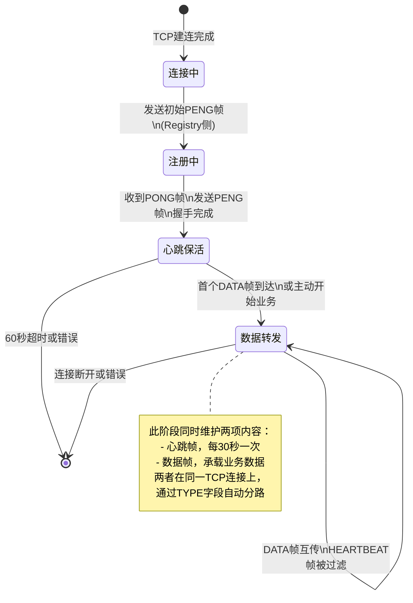
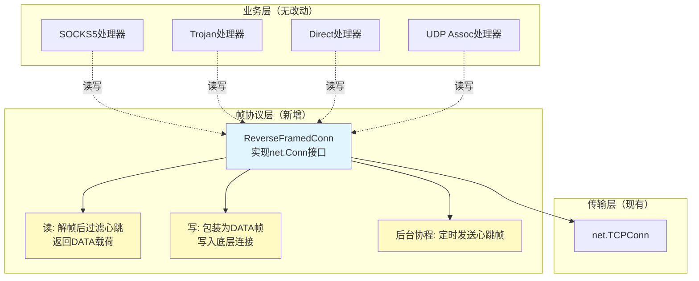
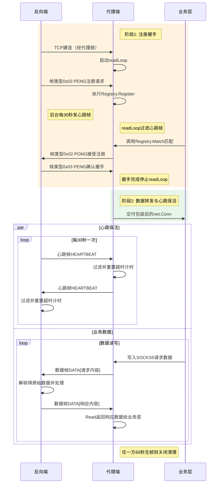
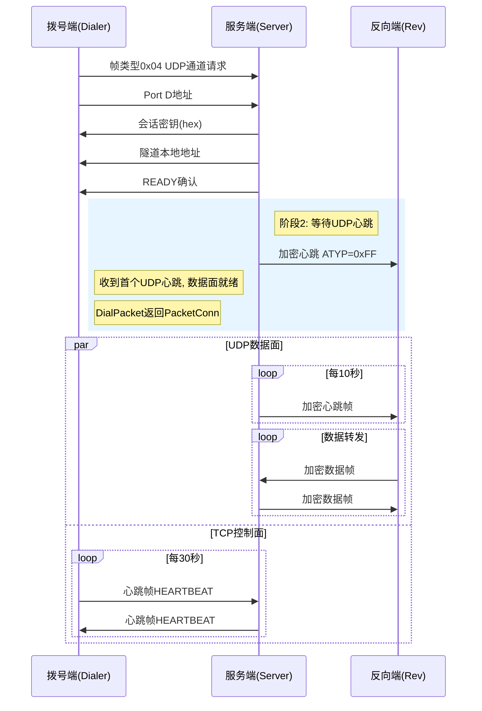

# 统一反向连接帧协议 (Unified Reverse Frame Protocol)

## 背景

当前反向连接存在两种保活机制不一致的问题：

| 场景 | 当前状态 | 问题 |
|------|---------|------|
| 普通TCP反向连接 | 注册阶段有PING/PONG，业务阶段无心跳 | NAT超时静默断连，业务层无感知 |
| 反向UDP通道控制面 | 无独立保活机制 | 和普通TCP不统一 |

核心矛盾：**同一条TCP连接上无法区分心跳字节和业务数据**。需要统一的帧协议解决分路问题。

---

## 帧格式定义

```
┌──────────┬────────────┬─────────────────────┐
│  TYPE    │  LENGTH    │  PAYLOAD            │
│  1 byte  │  2 bytes   │  0 ~ 65535 bytes   │
│          │  big-endian│                     │
└──────────┴────────────┴─────────────────────┘
```

- **TYPE**: 帧类型标识（1字节）
- **LENGTH**: 载荷长度（2字节大端序），不含TYPE和LENGTH本身
- **PAYLOAD**: 可变长载荷，由帧类型决定含义

最小帧：3字节（TYPE + LENGTH=0）
最大帧：65538字节（TYPE + LENGTH=65535 + 65535字节数据）

---

## 帧类型注册表

| TYPE | 名称 | 方向 | 载荷说明 | 替代旧协议 |
|------|------|------|---------|-----------|
| `0x01` | HEARTBEAT | 双向 | 空（LENGTH=0） | PingMsg(0x01)、tcpHbByte(0x00) |
| `0x02` | PONG | 代理端→反向端 | 空 | PongMsg(0x02)，注册接受 |
| `0x03` | PENG | 反向端→代理端 | 空 | PengMsg(0x06)，注册确认 |
| `0x04` | UDP_CHANNEL | 代理端→反向端 | 变长（通道命令） | udpChannelCmd(0x04) + 后续明文行 |
| `0x05` | DATA | 双向 | 原始应用层数据 | 无（新增） |

### 各帧类型详解

#### 0x01 HEARTBEAT — 心跳保活

```
方向: 双向（代理端 ↔ 反向端）
间隔: 发送方每 30s 发一次
超时判定: 接收方 60s 未收到任何帧 → 判定链路死亡
载荷: 空 (LENGTH = 0x0000)
用途: 保持NAT映射、检测链路存活
```

#### 0x02 PONG — 注册接受

```
方向: 代理端 → 反向端
时机: Registry.Match() 成功匹配到一个可用连接后
载荷: 空
作用: 通知反向端"我接受了你的注册"
后续: 反向端收到PONG后停止发送PING，回复PENG
```

#### 0x03 PENG — 注册确认

```
方向: 反向端 → 代理端
时机: 收到PONG之后立即发送
载荷: 空
作用: 确认注册握手完成
后续: 代理端收到PENG后进入数据转发阶段
```

#### 0x04 UDP_CHANNEL — UDP通道命令

```
方向: 代理端 → 反向端
时机: 客户端发起UDP ASSOCIATE时
载荷: 变长，内容为通道建立所需信息（见下方子协议）
作用: 在已有反向TCP连接上复用，请求开启一个UDP数据通道
```

**UDP_CHANNEL 子协议（载荷内部格式）：**

```
步骤     方向          内容                    格式
────    ──────────   ────────────────────   ───────────────────
1       代理→反向      通道命令                [0x04] TYPE帧头
2       代理→反向      代理端Port D地址        "host:port\n"
3       反向→代理      Session Key (hex)      "64个hex字符\n"
4       反向→代理      tunnel本地地址          "host:port\n"
5       反向→代理      READY确认               "READY\n"
```

> 注意：UDP_CHANNEL的载荷仍然是多行文本（与现有实现兼容），只是外层被TYPE帧包装。
> 这样UDP通道的TCP握手逻辑无需改动，只需在读写时加/去帧头。

#### 0x05 DATA — 应用层数据

```
方向: 双向
载荷: 原始应用层数据（SOCKS5/Trojan/Direct等协议的字节流）
用途: 承载所有非控制类通信
关键: 业务层通过 Read() 拿到的就是DATA帧的payload，对帧协议完全无感
```

---

## 协议状态机



---

## 数据流对比

### 改造前（单字节协议）

```
┌─────────────────────────────────────────────────────────────┐
│                   同一条 TCP 连接                            │
│                                                             │
│  [0x01] [0x01] [0x01] ... [0x02] [0x06] [SOCKS5数据...]  │
│   PING   PING   PING      PONG   PENG   ???业务数据???     │
│                                                             │
│  问题: 0x06之后的字节到底是心跳还是SOCKS5？                  │
│        无法区分！                                            │
└─────────────────────────────────────────────────────────────┘
```

### 改造后（帧协议）

```
┌─────────────────────────────────────────────────────────────┐
│                   同一条 TCP 连接                            │
│                                                             │
│  ┌──────┐ ┌──────┐ ┌──────┐     ┌──────┐ ┌──────┐ ┌──────┐│
│  │HB帧  │ │HB帧  │ │HB帧  │     │PONG帧│ │PENG帧│ │DATA帧││
│  │0x01  │ │0x01  │ │0x01  │     │0x02  │ │0x03  │ │0x05  ││
│  └──────┘ └──────┘ └──────┘     └──────┘ └──────┘ └──────┘│
│                                                             │
│  ┌──────┐ ┌──────┐                                        │
│  │HB帧  │ │DATA帧│  ← 业务阶段：心跳和数据共存              │
│  │0x01  │ │0x05  │    通过TYPE自动分路                      │
│  └──────┘ └──────┘                                        │
└─────────────────────────────────────────────────────────────┘
```

---

## 架构分层



### ReverseFramedConn 核心接口

```go
// 实现 net.Conn，业务层完全无感
type ReverseFramedConn struct {
    conn       net.Conn           // 底层TCP连接
    readBuf    bytes.Buffer       // 已解帧的数据缓存
    readMu     sync.Mutex
    writeMu    sync.Mutex
    closed     chan struct{}
    closeOnce  sync.Once
}

// Read: 循环读帧，过滤HEARTBEAT/PONG/PENG，返回DATA payload
func (c *ReverseFramedConn) Read(b []byte) (int, error)

// Write: 将数据包装为DATA帧写入
func (c *ReverseFramedConn) Write(b []byte) (int, error)

// 其他net.Conn方法委托给底层conn
func (c *ReverseFramedConn) Close() error
func (c *ReverseFramedConn) LocalAddr() net.Addr
// ...
```

---

## 时序图：完整生命周期

### 普通TCP反向连接



### Reverse UDP Channel



## 文件变更清单

| 文件 | 变更内容 |
|------|---------|
| `reverse/frame.go` | **新建**: 帧类型常量、编解码函数、ReverseFramedConn |
| `reverse/registry.go` | 改造: ManagedConn.readLoop 改为读帧; PingMsg/PongMsg/PengMsg 废弃 |
| `server/reverse.go` | 改造: handleReverseConn 用帧协议; handleReverseUDPChannel 用帧协议包装TCP |
| `dialer/reverse.go` | 改造: DialPacket 握手用帧协议; tcpKeepalive 改为帧心跳 |

---

## 兼容性

- **不兼容旧版本**: 帧头是新增的，旧版客户端/服务端无法识别
- **升级策略**: 代理端和反向端必须同时升级
- **配置文件**: 无需改动
